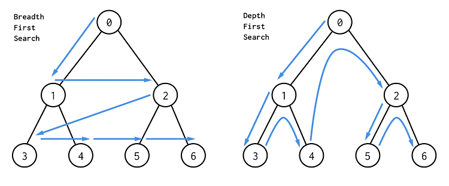

DFS와 BFS는 비선형 자료구조인 그래프에 대한 탐색 알고리즘이다. 그래프는 정점과 간선으로 이루어져있다. 그래프 탐색 순서에 따라 두 알고리즘이 구분되며 주어진 문제에 따라 효율적인 방식을 선택할 수 있다. 두 알고리즘 모두 노드수 + 간선수 만큼의 시간 복잡도를 갖는다. O(v+n), 즉 O(n)이다.

</img>

# BFS (Breadth First Search)

너비 우선 탐색은 정점과 같은 레벨에 있는 노드들을 먼저 탐색하는 방식이며, <b>두 개의 큐(queue)</b>를 사용한다.

### 특징

- 루트와 가까운 노드들부터 찾기 때문에 최단거리를 탐색할때 유용하다.
- 큐에 각 노드의 정보를 기록해야하기 때문에 메모리를 많이 사용한다.
- 찾고자 하는 타겟 노드가 루트노드와 근접하다고 예상될 경우 BFS를 사용한다.
- 지도 어플에서 특정 위치까지의 <b><u>최단거리</u></b> 등에 사용된다.

### 구현

```js
const bfs = (graph, startNode) => {
  const visited = []; // 탐색한 노드들이 저장된 queue
  let needToVisit = []; // 탐색할 노드들이 저장된 queue (FIFO, 선입선출)

  needToVisit.push(startNode); // 노드 탐색 시작!

  while (needToVisit.length) {
    // 탐색할 노드가 없을때까지
    const node = needToVisit.shift(); // 가장 먼저 저장된 첫 번째 데이터가 먼저 나감 (queue)
    if (!visited.includes(node)) {
      visited.push(node);
      needToVisit = [...needToVisit, ...graph[node]]; // bfs는 방문 예정인 노드를 우선 두고, 꺼내온 노드의 자식 노드들을 뒤에 위치시킨다.
    }
    return visited;
  }
};
```

# DFS (Depth First Search)

깊이 우선 탐색은 정점의 자식들을 먼저 탐색하는 방식으로 <br>한 개의 큐와 한 개의 스택</b>을 사용한다.

### 특징

- BFS보다 속도가 느릴 수 있다.
- 미로 게임 등에서 경로가 존재하는지 판별할 때 유용하다.
- DFS는 처음으로 발견된 해답이 최단거리라는 보장이 없지만, BFS는 노드에서 가까운 곳부터 찾기 때문에 경로 탐색시에 가장 먼저 찾아지는 것이 최단거리라고 할 수 있다.

### 구현

```js
const dfs = (graph, startNode) => {
  const visited = [];
  const needToVisit = []; // 탐색할 노드들이 저장된 stack (LIFO, 후입선출)

  needToVisit.push(startNode);

  while (needToVisit.length) {
    const node = needToVisit.pop(); // 가장 마지막으로 저장된 데이터가 먼저 나감 (stack)
    if (!visited.includes(node)) {
      visited.push(node);
      needToVisit = [...graph[node], ...needToVisit]; // dfs는 해당 노드의 가장 마지막 자식 노드까지 다 탐색하고 나서 그 다음으로 방문 예정이었던 노드를 탐색한다.
    }
    return visited;
  }
};
```
