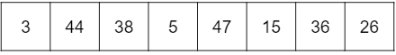
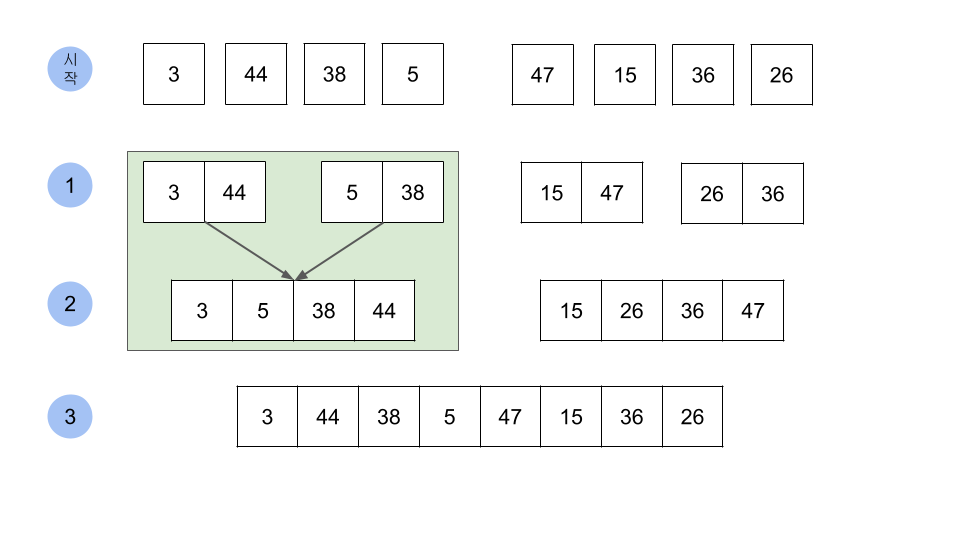

# 병합 정렬

- 설명 

  병합 정렬은 분할 정복에 기반한 알고리즘으로 큰 문제를 아주 작은 문제로 나눈 뒤 작은 문제를 해결하며 최종적으로 큰 문제를 해결한다. 배열이 하나의 원소만 존재할 때까지 분할한다. 그리고 각 배열을 병합한다.

- 시간복잡도

  병합정렬의 시간복잡도는 O(단계(높이) * 배열의 길이)로 표현할 수 있다. 

  - 단계

    길이가 N인 배열은 1개의 원소만 남을때까지 분할되고, 병합되는 과정에서 배열의 길이는 2배씩 증가한다. 즉 2**단계 = N이고, 단계 = logN으로 표현할 수 있다. 따라서 배열의 길이가 N일 때 단계는 logN이다.

  - 반복 횟수

    각 단계에서 정렬에 필요한 반복 횟수는 N번이다. 따라서 병합 정렬의 시간복잡도는 O(NlogN)이다.



분할 : 본 배열을 더 이상 쪼갤 수 없을 때까지 쪼개면 [3] [44] [38] [5] [47] [15] [36] [26] 다음과 같은 형태가 된다.
정복 : 두 배열을 하나로 합쳐 정렬을 한다. 즉 [3]과 [44]을 합치고 정렬 [38]과 [5], [47]과 [15], [36]과 [26]을 각각 합치고 정렬하면 다음과 같다. [3, 44] [5, 38] [15, 47], [26, 36]

이처럼 병합 정렬은 큰 문제를 작은 문제로 분할하고 큰 문제가 될 때까지 정복(정렬) 과정을 거쳐 해를 찾는다.

```js
function mergeSort(arr) {
  console.log('arr', arr)
  if(arr.length === 1) return arr;

  const mid = Math.ceil(arr.length/2);

  const left = arr.slice(0, mid);
  const right = arr.slice(mid);
  return merge(mergeSort(left), mergeSort(right))
}

function merge(left, right) {
  const sortedArr = [];

  while(left.length && right.length) {
    if(left[0] < right[0]) {
      sortedArr.push(left.shift())
    } else {
      sortedArr.push(right.shift())
    }
  }

  return [...sortedArr, ...left, ...right]
}
```

mergeSort([3, 44, 38, 5, 47, 15, 36, 26])를 실행할 때, mergeSort의 입력 배열을 로그로 찍으면 다음과 같은 것을 확인할 수 있다. 

```js
// input value: [3, 44, 38, 5, 47, 15, 36, 26]
arr [3, 44, 38, 5, 47, 15, 36, 26]
arr [3, 44, 38, 5]
arr [3, 44]
arr [3]
arr [44]
arr [38, 5]
arr [38]
arr [5]
arr [47, 15, 36, 26]
arr [47, 15]
arr [47]
arr [15]
arr [36, 26]
arr [36]
arr [26]

// return value: [3, 5, 15, 26, 36, 38, 44, 47]
```

mergeSort([3, 44, 38, 5, 47, 15, 36, 26])를 트리 형태로 표시하면 아래의 이미지와 같다.




> reference

- <a href="https://kangworld.tistory.com/74">병합 정렬(Merge Sort) 코드와 시간 복잡도</a>