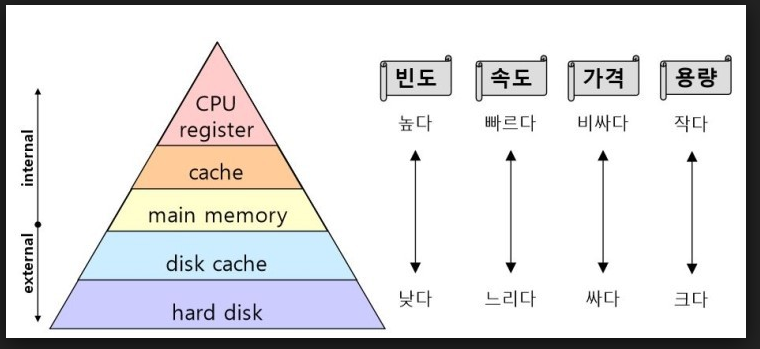
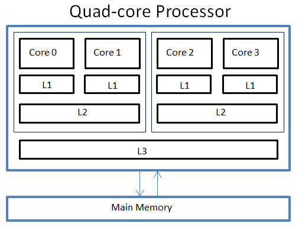
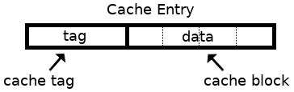
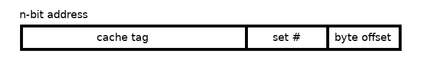

# 캐시 메모리

CPU는 프로그램을 실행하는 과정에서 메모리에 저장된 데이터를 빈번하게 사용한다. 하지만 CPU가 메모리에 접근하는 시간은 CPU의 연산속도보다 느리다. CPU가 연산을 빨리하더라도 메모리에 접근하는 시간이 오래 걸리면 CPU의 빠른 연산 속도는 쓸모가 없어진다. 따라서 이처럼 속도가 빠른 장치와 느린 장치의 속도 차이에 따른 병목 현상을 줄이기 위한 메모리를 말한다.

## 저장장치 계층구조 (Memory Hierarchy)

컴퓨터에는 여러 저장장치가 있는데, 저장장치의 속도와 용량은 반비례한다. 속도가 빠르면 용량이 작고 비싸고, 속도가 느리면 용량이 크고 가격이 저렴하다. 저장장치들의 장단점이 명확하므로, 어느 하나의 저장장치만 이용하지 않는다. 그래서 일반적으로 컴퓨터는 다양한 저장장치를 모두 사용한다.

이때, 컴퓨터가 사용하는 저장장치들은 CPU에 얼마나 가까운가를 기준으로 계층적으로 나타낼 수 있다. 이를 저장장치 계층구조라고 한다.

계층이 높을수록 속도가 빠르고, 용량이 작고, 비싸다. 계층이 낮을수록 속도가 느리고, 용량이 크고, 저렴하다.

 

> ## 캐시메모리

 

캐시메모리는 CPU와 메모리사이에 위치하고, 레지스터보다 용량이 크고 메모리보다 빠른 SRAM(Static RAM)기반의 저장장치이다. 메모리에서 CPU가 사용할 일부 데이터를 미리 캐시메모리로 가져온다.

저장장치 계층구조에서 레지스터와 메인메모리 사이에 캐시가 있었듯이 캐시도 CPU 코어와 가까운 순서로 계층을 구성한다. 코어와 가장 가까운 순서대로 L1, L2, L3라고 한다. 일반적으로 L1, L2 캐시는 코어 내부에, L3는 코어 외부에 위치한다.

CPU가 메모리 내에 데이터가 필요하다고 판단하면 우선 L1 캐시에 해당 데이터가 있는지를 확인하고, 없다면 L2, L3 순으로 데이터를 검색한다.

멀티 코어 프로세서에서 L1-L2-L3 캐시는 일반적으로 다음과 같이 구현된다. L1 캐시와 L2 캐시는 코어마다 코유한 캐시 메모리로 할당되고, L3 캐시는 여러 코어가 공유하는 형태로 사용된다.

코어와 가장 가까운 L1 캐시는 조금이라도 접근 속도를 빠르게 만들기 위해 명령어만을 저장하는 L1 캐시인 L1I 캐시와 데이터만을 저장하는 L1 캐시인 L1D 캐시로 분리하는 경우도 있다. 이를 분리형 캐시라(split cache)고 한다.

 

> ## 캐시메모리에 저장되는 기준은 무엇일까

 
메인메모리가 보조기억장치의 일부를 복사하여 저장하는 것처럼 캐시메모리는 메모리의 일부를 복사하여 저장한다. 그렇다면 캐시메모리는 무엇을 저장해야할까?

보조기억장치는 전원이 꺼져도 기억할 대상을 저장하고, 메모리는 실행 중인 대상을 저장한다면 캐시메모리는 CPU가 사용할법한 대상을 예측하여 저장한다. 이때 자주 사용될 것으로 예측한 데이터가 실제로 들어맞아 캐시메모리 내 데이터가 CPU에서 활용될 경우를 캐시히트라고 한다. 반대로 자주 사용될 것으로 예측하여 캐시 메모리에 저장했지만, 예측이 들려 메모리에서 필요한 데이터를 직접 가져와야 하는 경우를 캐시미스라고 한다. 캐시미스가 발생하면 CPU가 필요한 데이터를 메모리에서 직접 가져와야 하기 떄문에 캐시 메모리의 이점을 활용할 수 없다.

캐시가 히트되는 비율을 캐시 적중률(cache hit ratio)은 다음과 같이 계산한다.

> 캐시히트횟수 / (캐시히트 횟수 + 캐시미스 횟수)

캐시메모리는 참조 지역성의 원리(locality of reference, principle of locality)에 따라 메모리로부터 가져올 데이터를 결정한다. 참조 지역성의 원리란, CPU가 메모리에 접근할 때의 주변 경향을 바탕으로 만들어진 원리이다.

- CPU는 최근에 접근했던 메모리 공간에 다시 접근하려는 경향이 있다.
- CPU는 접근한 메모리공간 근처를 접근하려는 경향이 있다.

 

### <u>최근에 접근했던 메모리 공간에 다시 접근하려는 경향: 시간 지역성</u>

변수에 저장된 값은 일반적으로 한 번만 사용되지 않고 프로그램이 실행되는 동안 여러번 사용된다. 즉 CPU는 최근에 접근했던 (변수가 저장된) 메모리 공간을 여러번 다시 접근할 수 있다.

예를 들어 for, while문에서 사용되는 변수는 반복문이 진행되면서 여러번 사용되는데, 이렇게 최근 접근했던 메모리 공간에 다시 접근하려는 경향을 시간 지역성이라고 한다.

 

### <u> 접근한 메모리 공간 근처를 접근하려는 경향: 공간 지역성</u>

CPU가 실행하려는 프로그램은 보통 관련 데이터들끼리 한데 모여있다. 예를들어 메모리 내에 워드 프로세서 프로그램, 웹 브라우저 프로그램, 게임 프로그램이 있다고 가정할때, 이 세 프로그램은 서로 관련있는 데이터끼리 모여서 저장된다. 워드 프로세서 프로그램은 워드 프로세서 관련 데이터들이 모여 저장되고, 웹 브라우저 프로그램은 웹 브라우저 프로그램 관련 데이터들끼리 모여 저장되고, 게임 프로그램은 게임 관련 데이터들이 모여 저장된다.

하나의 프로그램 내에서도 관련있는 데이터들이 모여 저장된다. 워드 프로세서 프로그램에 자동저장기능, 입력기능, 출력기능이 있다고 할때, 각각의 기능과 관련한 데이터는 모여 저장된다.

따라서 CPU가 워드 프로세서 프로그램을 실행할 때에는 워드 프로세서 프로그램이 모여 있는 공간 근처를 집중적으로 접근할 것이고, 사용자가 입력을 할때에는 입력 긴으이 모여있는 공간 근처를 접근한다. 이렇게 접근할 메모리 공간 근처를 접근하려는 경향을 공간 지역성이라고 한다.

이 두가지 경향(시간 지역성, 공간 지역성)의 참조 지역성 원리에 입각해 CPU가 사용할 법한 데이터를 예측한다.

 

> ## 캐시 블록과 메모리 주소

 

캐시 메모리는 <b>캐시 블록</b>이라는 데이터 단위를 가진다.

- 캐시블록은 데이터를 담고 있다.
- 캐시태그는 캐시블록의 고유 식별값으로 CPU 프로세서는 캐시 태그 값을 통해 캐시블록에 접근한다.
- 캐시태그에는 캐시 블록에 올바른 데이터가 저장되어있는지 표현하는 유효비트(Valid Bit)가 포함되어있다. 캐시 블록이 유효하지 않다면(비어있거나 올바르지 못한 값을 가진 경우) 유효비트는 0으로 설정된다.

 

 

> ## 캐시 매핑

캐시 매핑이란 캐시가 히트되기 위해 매핑하는 방법을 말한다. CPU의 레지스터와 주 메모리 간에 데이터를 주고받을때를 기반으로 설명한다. 레지스터는 주 메모리에 비하면 굉장히 작고 주 메모리는 굉장히 크기 때문에 작은 레니스터가 캐시 계층으로써 역할을 잘 해주려면 이 매핑을 어떻게 하느냐가 중요하다.

- 직접 매핑 (direct mapping)
  메모리가 1~100이 있고, 캐시가 1~10이 있다면, 1에 1~10, 2에 1~20 이런 식으로 매핑하는 것을 말한다. 처리가 빠르다는 장점이 있지만 충돌 발생이 잦다는 단점이 있다.

- 연관 매핑 (associative mapping)
  순서를 일치시키지 않고 관련있는 캐시와 메모리를 매핑한다. 충돌이 적지만 모든 블록을 탐색향 해서 속도가 느리다.

- 집합 연관 매핑 (set associative mapping)
  직접 매핑과 연관 매핑을 합쳐놓은 것이다. 순서는 일치시키지만 집합을 둬서 저장하며 블록화되어 있기 때문에 검색은 좀 더 효율적이다. 예를 들어 메모리가 1~100이 있고 캐시가 1~10이 있다면 1~5에는 1~50의 데이터를 무작위로 저장시킨다.

 

> reference

- <a href="https://blog.naver.com/PostView.nhn?blogId=techref&logNo=222290234374&parentCategoryNo=&categoryNo=&viewDate=&isShowPopularPosts=false&from=postView">캐시 메모리의 구조와 캐시히트, 캐시미스</a>

- <a href="https://www.allaboutcircuits.com/technical-articles/principles-of-cache-design/">Principles of Cache Design</a>

- <도서> 면접을 위한 CS 전공지식 노트
- <도서> 혼자 공부하는 컴퓨터 구조 + 운영체제
