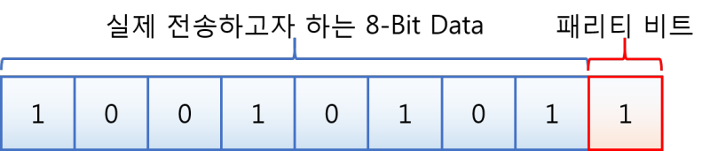
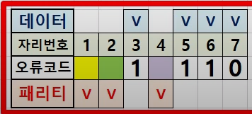

# 패리티 비트 (parity bit)

</img>

 
송신 컴퓨터에서 수신 컴퓨터로 2진수의 전기신호를 전송할때, 전송과정에서 오류가 생길 수 있다. 따라서 송신 컴퓨터는 수신 컴퓨터에서 해당 데이터에 오류가 있는지 확인할 수 있도록 이진수 데이터 끝에 0 또는 1의 패리티 비트를 붙여 보낸다.

따라서 수신 컴퓨터는 숫니받은 데이터의 끝의 패리티 비트를 보고, 해당 데이터에 오류가 있는지 확인하여 오류가 있다면 송신 컴퓨터에게 데이터 재송신을 요청한다.

 

## 패리티 비트 유형

패리티 비트에는 짝수, 홀수 유형이 있다. 송신자는 사용하는 패리티 유형에 따라 데이터에 0 또는 1을 붙이고, 송신자는 수신자에게 어떤 패리티 타입을 사용했는지 공유한다.

- 짝수 패리티

  데이터 비트와 패리티 비트를 포함한 전체 비트에서 1의 개수가 짝수가 되도록 패리티 비트를 정한다.

- 홀수 패리티

  데이터 비트와 패리티 비트를 포함한 전체 비트에서 1의 개수가 홀수가 되도록 패리티 비트를 붙인다.

# 해밍 코드

</img>

하나의 패리티 비트만 사용하는 경우 수신자는 오류 검출 및 데이터 재송신 요청만 가능했다. 해밍코드는 여러개의 패리티 비트를 사용해 오류가 발생한 데이터의 위치를 검출하여 수정할 수 있다.

 

## 패리티 비트 개수 정하기

해밍코드에서 몇 개의 패리티 비트를 사용할지는 다음 공식을 사용해서 구할 수 있다. p는 패리티 비트 개수, n은 데이터의 비트 수이다.

> 2^p >= p + n + 1

예를 들어 4비트 데이터를 전송하는 경우, 3개의 패리티 비트가 필요하다. 5비트 데이터를 전송하는 경우는 4개가 필요하다.

 

## 패리티 비트 위치

해밍코드에서 패리티 비트의 위치는 2^n의 위치에 생성된다. 앞서 데이터 비트가 4인 경우, 3개의 패리티 비트가 필요하다는 것을 확인했다. 그렇다면 총 7개의 비트가 필요하다. 여기서 패리티 비트의 위치는 1번째(2^0), 2번째(2^1), 4번째(2^2)에 위치하게 된다.

 

## 패리티 비트 결정하기

패리티 비트는 위치에 따라 n번째 비트에서 시작하여 n비트만큼을 포함하고, n비트씩 건너뛴 비트들을 대상으로 결정한다.

1번째에 위치한 패리티 비트는 1번째 비트에서 시작하여 1비트만큼을 포함하고, 1비트씩 건너뛴 비트들을 대상으로 결정한다. 즉, 1번째에 위치한 패리티 비트는 1,3,5,7번째 비트들을 대상으로 결정된다.

2번째에 위치한 패리티 비트는 2번째 비트에서 시작하여 2비트만큼을 포함하고, 2비트씩 건너뛴 비트들을 대상으로 결정한다. 즉, 2번째에 위치한 패리티 비트는 2,3,6,7번째 비트들을 대상으로 결정된다.

4번째에 위치한 패리티 비트는 4,5,6,7번째 비트들을 대상으로 결정된다.

 

## 해밍코드 만들어보기

1. 해밍코드를 보고 원본 데이터 찾기

   7비트의 1011001이라는 이진수가 주어졌을때, 패리티 비트는 2^n 번째에 위치하기 때문에 이 위치에 비트들을 제외한 1001이 원본 데이터이다.

2. 데이터 원본을 보고 홀수 패리티로 해밍코드 만들기

   1110이라는 원본 데이터가 있을때, 패리티의 개수는 2^3 >= 3 + 4 + 1 이므로 3개이다. 또한, 패리티 비트가 들어갈 위치는 2^0번째이므로 1,2,3번째임을 알 수 있다.

   따라서 \_ _ 1 _ 1 1 0 로 7비트의 해밍코드를 예상해볼 수 있다.

   1번째 자리는 1,3,5,7번째 비트들을 대상으로 결정되므로 1이 들어가야한다.
   2번째 자리는 2,3,6,7번째 비트들을 대상으로 결정되므로 0이 들어가야한다.
   4번째 자리는 4,5,6,7번째 비트들을 대상으로 결정되므로 1이 들어가야한다.

   따라서 1011110 으로 해밍코드를 만들 수 있다.

 

### 참고자료

- <a href="https://www.youtube.com/watch?v=CLy9O81SXlU">해밍코드 10분 컷</a>
- <a href="https://wooono.tistory.com/400">[Network] 패리티 비트와 해밍 코드</a>
