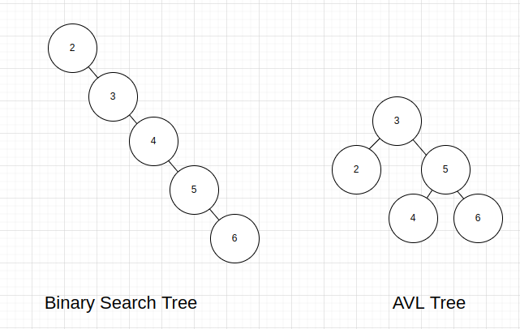
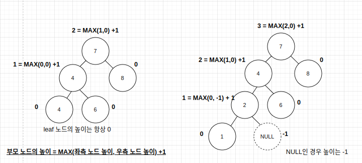
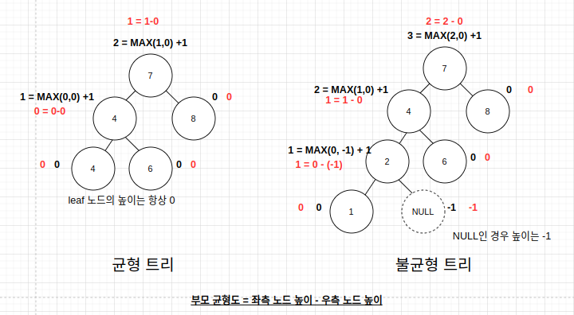

# AVL

AVL 트리는 노드의 추가나 삭제 시 스스로 균형을 조절하는 이진 탐색 트리이다. 모든 노드에 대해 왼쪽, 오른쪽 하위 트리의 높이 차이가 1보다 클 수 없다.

AVL 트리는 균형도를 사용해 삽입과 삭제 시 트리의 균형을 맞춘다. 균형도가 절대값 2 미만이면 균형 트리이고, 절대값 2 이상이면 불균형 트리이다.

## 균형도 계산하기

균형도를 계산하기 위해서 각 노드의 높이를 먼저 계산해야한다. 높이는 가장 아래에서부터 위로 올라가며 계산한다. Leaf 노드의 높이는 항상 0이다.

- leaf 노드의 높이는 0이다.
- null인 노드의 높이는 -1이다.
- 부모 노드의 높이는 좌측 노드와 우측 노드의 최댓값 + 1이다.
- 균형도는 좌측 노드 높이 - 우측 노드 높이이다.

## 균형도에 따른 4가지 문제

- LL

  - 부모 노드의 균형도가 2이고, 좌측 자식 노드의 균형도가 1인 경우, LEFT-LEFT로 LL문제라고 한다.

- LR

  - 부모 노드의 균형도가 -2이고, 우측 자식 노드의 균형도가 -1인 경우, RIGHT-RIGHT로 RR 문제라고 한다.

- LR

  - 부모 노드의 균형도가 2이고, 좌측 자식 노드의 균형도가 -1이 경우를 LEFT-RIGHT로 LR 문제라고 한다.

- RL

  - 부모 노드의 균형도가 -2이고 우측 자식 노드의 균형도가 1인 경우, RIGHT-LEFT로 RL 문제라고 한다.
