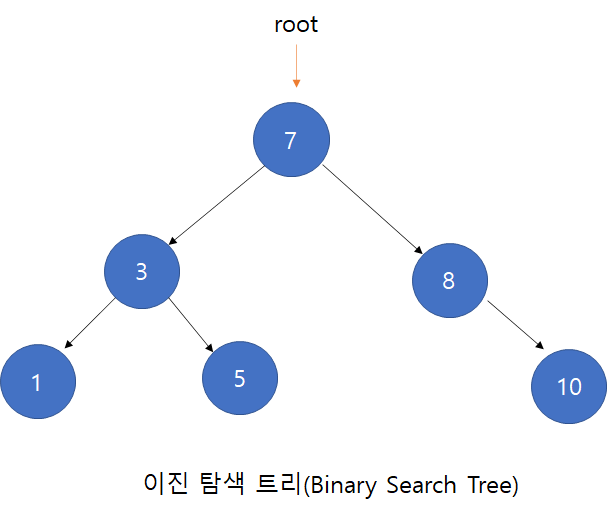

# Binary Search Tree



이진 탐색 트리는 작은 값이 왼쪽에, 큰 값이 오른쪽에 저장되는 이진 트리(자식 노드가 두개인 트리)이다. 이진트리는 자료의 삽입, 삭제 방법에 따라 정 이진 트리, 완전 이진 트리, 포화 이진 트리로 나뉜다.

- 정 이진 트리는 각 노드개 0개 혹은 2개의 자식 노드를 갖는다.
- 완전 이진 트리는 마지막 레벨을 제외한 모든 노드가 가득 차 있어야하고, 마지막 레벨의 노드는 모두 차 있지 않아도 되지만 왼쪽은 채워져있어야 한다.
- 포화 이진 트리: 정 이진트리이면서 완전 이진 트리이다. 모든 리프 노드의 레벨이 동일하고, 모든 레벨이 가득 채워져 있어야 한다.

```js
class Node {
  constructor(data) {
    this.data = data;
    this.left = null;
    this.right = null;
  }
}

class BinarySearchTree {
  constructor() {
    this.root = null;
  }
  // 구현할 함수
  insert(data);
  remove(data);

  // helper 함수
  findMinNode()
  getRootNode()
  inodrder(node); // 중위 순회
  preorder(node); // 전위 순회
  postorder(node); // 후위 순회
  search(node, data);
}
```

### 삽입

```js
insert(data) {
  const newNode = new Node(data);

  if(this.root === null) {
    this.root = newNode;
  } else {
    this.insertNode(this.root, newNode); // 트리 내에 올바른 위치를 찾아서 삽입
  }
}

insertNode(node, newNode){
  // 뉴노드의 데이터가 노드의 데이터보다 작으면 노드 왼쪽으로
  if(newNode.data < node.data) {
    if(node.left === null) {
      node.left = newNode;
    } else {
      this.insertNode(node.left, newNode);
    }
  }
  // 뉴노드의 데이터가 노드의 데이터보다 크면 노드 오른쪽으로
  else {
    if(node.right === null) {
      node.right = newNode;
    } else {
      this.insertNode(node.right, newNode);
    }
  }
}
```

### 삭제

```js
remove(data) {
  this.root = this.removeNode(this.root, data);
}

removeNode(node, key) {
  if(node === null) {
    return null;
  }

  else if (key < node.data) {
    node.left = this.removeNode(node.left, key);
    return node;
  }

  else if (key > node.data) {
    node.right = this.removeNode(node.right, key);
    return node;
  }

  else {
    // 삭제하려는 노드가 리프 노드일 경우
    if(node.lefrt === null && node.right === null) {
      node = null;
      return node;
    }

    if(node.left === null) {
      node = node.right;
      return node;
    }

    else if (node.right === null) {
      node = node.left;
      return node;
    }

    // 노드의 왼쪽, 오른쪽 자식이 모두 있을때
    const aux = this.findMinNode(node.right);
    node.data = aux.data;

    node.right = this.removeNode(node.right, aux.data);
    return node;
  }
}
```

## 이진 트리 순회 알고리즘 (Binary Tree Traversal)

이진 트리 순회 알고리즘은 트리에 저장된 모든 값을 중복이나 빠짐없이 살펴보고 싶을때 사용한다. 이진 트리 순회 방법 중 깊이 우선 방법으로는, 중위, 전위, 후위 순회가 있고, 너비 우선 순회 방법으로는 레벨 순회가 있다.

```js
// 중위 순회 (left, data, right)
inorder(node) {
  if(node !== null) {
    this.inorder(node.left);
    console.log(node.data);
    this.inorder(node.right);
  }
}

// 전위 순회 (data, left, right)
preorder(node) {
  if(node !== null) {
    console.log(node.data);
    this.preorder(node.left);
    this.preorder(node.right);
  }
}

preorder(node) {
  const finalData = [];
  const traverse = (node) => {
    finalData.push(node);
    if(node.left) {
      traverse(node.left);
    }
    if(node.right) {
      traverse(node.right);
    }
  }
  traverse(this.root);
}

// 후위 순회 (left, right, data)
postorder(node) {
  if(node !== null) {
    this.postorder(node.left);
    this.postorder(node.right);
    console.log(node.data);
  }
}

// 우선 너비 탐색
bfs() {
  let node = this.root;
  let queue = [node];
  const finalData = [];

  while(queue.length) {
    node = queue.shift();
    if(node.left) {
      queue.push(node.left);
    }
    if(node.right) {
      queue.push(node.right);
    }
    finalData.push(node.data);
  }
  return finalData;
}
```
