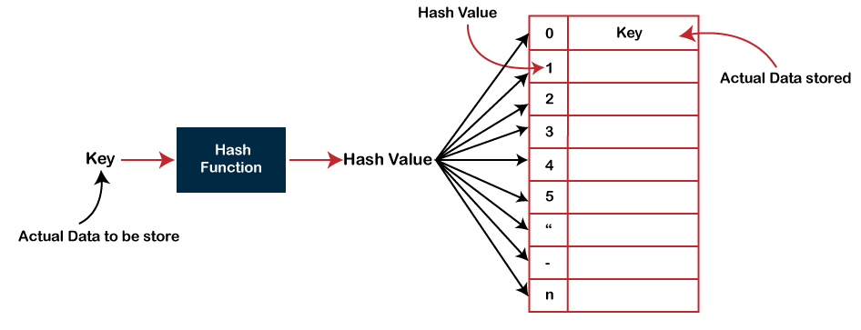

# Hash

해시는 해시 함수를 사용해 동작하는 자료구조이다. 특히 컴퓨터 보안의 암호화와 체크섬은 해싱에 크게 의존한다. 해시는 해시 함수를 사용해 하나의 값을 다른 값으로 매핑해 저장한다.


## 해시 함수

- 해시함수는 입력되는 데이터 타입과 무관하게 출력되는 해시값의 길이가 항상 고정되어있다.

- 해시함수는 서로 다른 입력값으로 동일한 해시값을 생성할 가능성이 있는데, 이때 해시 충돌이 발생한다고 한다.

## 해시 테이블



- 해시 테이블은 키와 값으로 구성된 검색 시스템이다.

- 즉, 해시 테이블에는 모든 키에 대응하는 값이 있고, 검색 수행 속도를 크게 증가시켜 O(1)의 시간 복잡도를 갖는다. (최악의 경우, 선형 탐색은 O(n), 이진 탐색에서는 O(logn)의 시간복잡도를 갖지만, 해싱은 항상 O(1)의 시간 복잡도를 갖는다.)

- 해시 함수가 리턴하는 해시값은 실제 데이터가 저장된 인덱스이다.

## 해시 충돌

만약 입력값을 10으로 나눈 나머지를 리턴하는 해싱 함수가 있다고 가정해보자.

```js
const hash = (input: number) => input % 10;
```

이때, input 값이 16일때, 26일때 모두 6을 리턴하여 해시 충돌이 발생한다. 해시 충돌이 발생할 경우, 해시 테이블의 성능을 떨어트리므로, 해시 함수를 충분히 복잡하게 정의하여 해시 충돌을 최소화하는 것이 좋다.

## 해시 충돌 해결

### 체이닝

해시값에 이미 데이터가 저장되어있담뎐, 연결리스트로 데이터를 연결한다. 체이닝은 연결리스트로 계속 데이터를 늘려가기 때문에 데이터의 해시값 (인덱스)은 바뀌지 않는데, 이는 Closed Addressing 방식이다.

### 개방 주소법 (Open addressing)

개방 주소법은 해시 충돌이 일어나면 다른 인덱스에 데이터를 저장한다. 다른 인덱스를 생성하는 방법은 다음 세가지가 있다. 각각을 하나씩 살펴보도록 하자.

- 선형 탐색 (Linear Probing)
- 제곱 탐색 (Quadratic Probing)
- 이중 해시 (Double Hashing)

### 선형 탐색

선형 탐색에서는 다음 인덱스가 비어있는지 확인하고, 비어있는 경우, 그 인덱스에 데이터를 저장하는 방식이다. 가장 좋은 케이스는, 바로 다음 인덱스가 비어있어 바로 데이터를 저장하는 것이고, 최악의 경우는 모든 인덱스가 비어있지 않는 경우이다.

### 제곱 탐색

선형 탐색이 바로 다음 인덱스가 비어있는지 확인한다면, 제곱 탐색은 제곱만큼 건너뛴 인덱스에 데이터를 삽입하는 방식이다.

### 이중 해시

해시 충돌 시 다른 해시 함수를 한 번 더 적용해 인덱스값을 만들어내 데이터를 저장한다.
