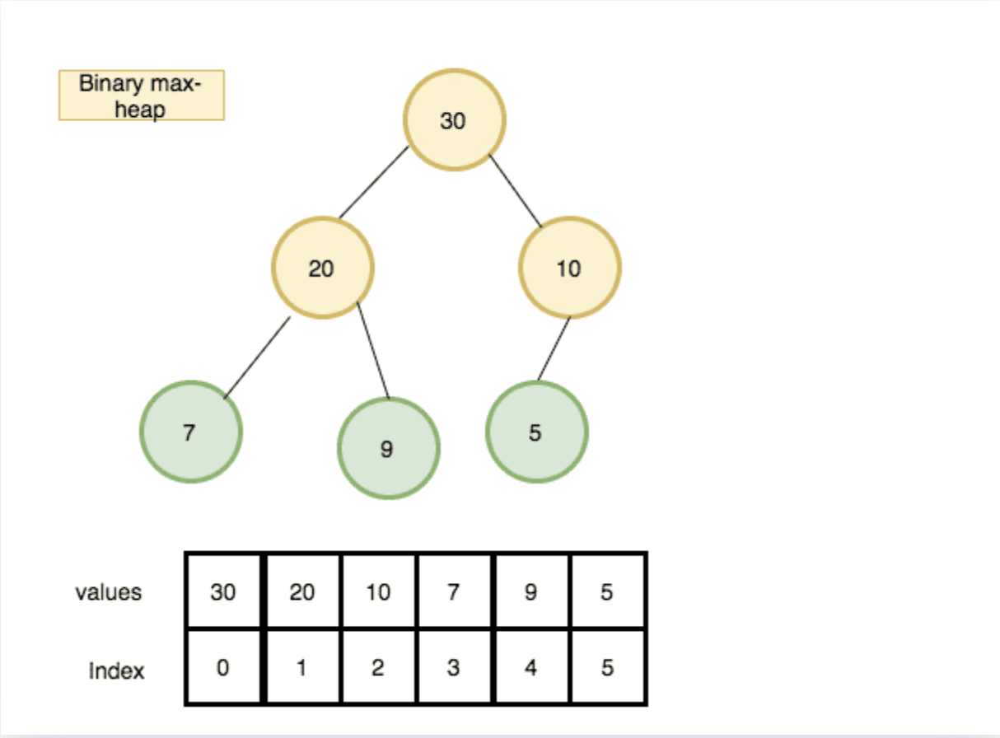

# Heap

자료구조 힙은 완전이진트리(complete binary tree)이다. 완전이진트리란, 마지막을 제외한 모든 레벨에서 모두 두 개의 자식노드를 가진다. 이때 노드는 왼쪽부터 채워진다. 다시 말하면, 깊이가 d일때, d-1까지는 perfect binary tree이면서 depth가 d인 마지막 레벨의 node는 왼쪽부터 채워진 트리이다.

## 특징

- 여러개의 값들 중 최대값과 최소값을 가장 빠르게 찾아낼 수 있다. 
    max heap은 부모가 자식보다 항상 크기 때문에 root가 최대값이 된다. min heap은 부모가 자식보다 항상 작으므로, root가 최소값이 된다.

- stack은 가장 나중에 들어온 요소가 삭제되고, queue는 가장 먼저 들어온 요소가 삭제되는 구조이다. 우선순위 큐는 가장 높은 우선순위의 요소가 삭제되는 구조이다. 힙은 우선순위 큐를 구현하는데 사용된다.

- 힙은 삽입과 삭제가 O(log n)의 시간복잡도를 가진다.

- 힙은 이진트리와는 다르게 중복된 값이 저장할 수 있다. 

## 구현 



힙은 배열을 이용해 구현할 수 있다. 배열의 인덱스를 i라고 할때, arr[i]의 왼쪽 자식은 arr[2i+1], 오른쪽 자식은 arr[2i+2]이고, i의 부모 인덱스는 arr[Math.floor(i-1)/2]이다.

### min heap

```js
class MinHeap {
    constructor() {
        this.heap = [];
    }
    // healper methods
    getLeftChildIndex(parentIdx) {
        return 2*parentIdx + 1;
    }
    getRightChildIndex(parentIdx) {
        return 2*parentIdx + 2;
    }
    getParentIdx(childIdx) {
        return Math.floor((childIdx-1)/2);
    }
    hasLeftChild(parentIdx) {
        return this.getLeftChildIndex(parentIdx) < this.heap.length;
    }
    hasRightChild(parentIdx) {
        return this.getRightchildIndex(parentIdx) < this.heap.length;
    }
    hasParent(childIdx) {
        return this.getParentIndex(index) >= 0;
    }
    getLeftChild(parentIdx) {
        return this.heap[this.getLeftChildIndex(parentIdx)];
    }
    getRightChild(parendIdx) {
        return this.heap[this.getRightChildIdx(parentIdx)];
    }
    getParent(childIdx) {
        return this.heap[this.getParentIdx(childIdx)];
    }

    // functions to create min heap
    swap(idxOne, idxTwo) {
        const temp = this.heap[idxOne];
        this.heap[idxOne] this.heap[idxTwo];
        this.heap[idxTwo] = temp; 
    }

    // return root (the smallest value of all nodes)
    peek() {
        if(this.heap.length === 0) return null;
        return this.heap[0]
    }

    // remove the root element and rearrange heap
    remove() {
        if(this.heap.length === 0) return null;
        const item = this.heap[0];
        this.heap[0] = this.heap[this.heap.length-1];
        this.heap.pop();
        this.heapifyDown();
        return item;
    }

    add(item) {
        this.heap.push(item);
        this.heapifyUp();
    }

    // this method is called when element is added to the heap
    heapifyUp() {
        let idx = this.heap.length - 1;
        while(this.hasParent(idx) && this.parent(idx) > this.heap[idx]) {
            this.swap(this.getParentIndex(idx), idx);
            index = this.getParentIndex(idx);
        }
    }

    // this method is called when element is removed from the heap
    heapifyDown() {
        let idx = 0;
        while(this.hasLeftChild(idx)) {
            let smallerChildIndex = this.getLeftChildIndex(idx);
            if(this.hasRightChild(idx) && this.getRightChild(idx) < this.getLeftChild(idx)) {
                smallerChildIndex = this.getRightChildIndex(idx);
            }
            if(this.heap[idx] < this.heap[smallerChildIndex]) {
                break;
            } else {
                this.swap(idx, smallerChildIndex);
            }
            idx = smallerChildIndex;
        }
    }

     printHeap() {
        let heap = ` ${this.heap[0]} `;
        for(let i = 1; i < this.heap.length; i++) {
            heap += ` -> ${this.heap[i]}`;
        }
        console.log(heap)
    }
}
```

### max heap

```js
class MaxHeap {
    constructor() {
        this.heap = [];
    }
    // Helper Methods (min heap과 동일)
    getLeftChildIndex(parentIndex) { return 2 * parentIndex + 1; }
    getRightChildIndex(parentIndex) { return 2 * parentIndex + 2; }

    getParentIndex(childIndex) {
        return Math.floor((childIndex - 1) / 2);
    }

    hasLeftChild(index) {
        return this.getLeftChildIndex(index) < this.heap.length;
    }

    hasRightChild(index) {
        return this.getRightChildIndex(index) < this.heap.length;
    }

    hasParent(index) {
        return this.getParentIndex(index) >= 0;
    }

    leftChild(index) {
        return this.heap[this.getLeftChildIndex(index)];
    }

    rightChild(index) {
        return this.heap[this.getRightChildIndex(index)];
    }

    parent(index) {
        return this.heap[this.getParentIndex(index)];
    }

    swap(indexOne, indexTwo) {
        const temp = this.heap[indexOne];
        this.heap[indexOne] = this.heap[indexTwo];
        this.heap[indexTwo] = temp;
    }

    peek() {
        if (this.heap.length === 0) {
            return null;
        }
        return this.heap[0];
    }

    remove() {
        if(this.heap.length === 0) return null;
        const item = this.heap[0];
        this.heap[0] = this.heap[this.heap.length-1];
        this.heap.pop();
        this.heapifyDown();
        return item;
    }

    add(item) {
        this.heap.push(item);
        this.heapifyUp();
    }

    heapifyUp() {
        let idx = this.heap.length - 1;
        while(this.hasParent(idx) && this.parent(idx) < this.heap[idx]) {
            this.swap(this.getParentIndex(idx), idx);
            idx = this.getParentIndex(idx);
        }
    }

    heapifyDown() {
        let idx = 0;
        while(this.hasLeftChild(idx)) {
            let largerChildIndex = this.getLeftChildIndex(idx);
            if(this.hasRightChild(idx) && this.rightChild(idx) > this.leftChild(idx)) {
                largerChildIndex = this.getRightChildIndex(idx);
            }
            if(this.heap[idx] > this.heap[largerChildIndex]) {
                break;
            } else {
                this.swap(idx, largerChildIndex);
            }
            idx = largerChildIndex;
        }
    }

    printHeap() {
        let heap = ` ${this.heap[0]} `;
        for(let i = 1; i < this.heap.length; i++) {
            heap += ` -> ${this.heap[i]}`;
        }
        console.log(heap)
    }
}
```

> reference

- <a href="https://reactgo.com/javascript-heap-datastructure/">How to implement Heap Data structure in JavaScript
</a>

- <a href="https://www.geeksforgeeks.org/min-heap-in-javascript/">Min Heap in JavaScript</a>

- <a href="https://gmlwjd9405.github.io/2018/05/10/data-structure-heap.html">이진트리</a>