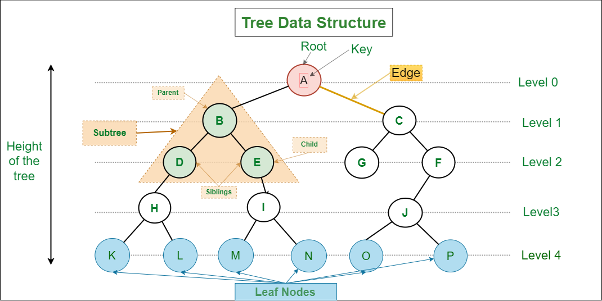

# 트리



## 트리 관련 용어 정리

- Parent node
  노드의 선행 노드를 해당 노드의 부모 노드라고 한다.

- Child node
  노드의 직계 후속 노드를 해당 노드의 자식 노드라고 한다.

- Root node
  트리의 최상단 노드로 부모노드가 없는 노드이다.

- Leaf node / External node
  자식 노드가 없는 노드를 리프 노드 또는 외부 노드라고 한다.

- Ancestor of a Node
  최상단 루트 노드부터 해당 노드까지 경로에서 선행하는 모든 노드를 조상 노드라고 한다. 위의 이미지에서는 A와 B가 E의 조상 노드이다. (간선으로 이어져있어야 함)

- Descendant
  Child node가 직계 후속 노드라면, 자손 노드는 해당 노드부터 리프 노드까지의 모든 후속 노드를 가르킨다.

- Sibling node
  같은 부모 노드를 가진 노드들을 형제 노드라고 한다.

- Level of a node
  루트 노드의 레벨은 0이고, 루트 노드부터 해당 노드까지의 경로로 연결된 간선의 개수이다.

- Internal node
  최소 한 개 이상의 자식 노드를 가진 노드를 내부 노드라고 한다.

- Neighbor of a Node
  해당 노드의 부모 또는 자식 노드를 해당 노드의 이웃이라고 한다.

- Subtree
  하위 항목과 함께 트리의 모든 노드

## 트리의 속성

- Number of edges
  간선은 두 노드 간의 연결을 말한다. 만약 트리가 N개의 노드가 있다면 N-1개의 간선을 갖는다. 노드 간 간선은 하나 뿐이다.

- Depth of a node
  노드의 깊이는 루트 노드부터 해당 노드까지 경로의 길이를 말하는데, 다시 말하면 간선의 개수(Number of Edges)와 동일하다.

- Height of a node
  노드의 높이는 해당 노드부터 리프 노드까지의 가장 긴 경로를 말한다.

- Height of a tree
  루트 노드부터 리프 노드까지의 가장 긴 경로를 말한다.

- Degree of a node
  해당 노드에 연결된 서브 트리의 개수를 노드의 정도라고 한다. 리프 노드의 정도는 0이다.

## 트리 자료 구조를 사용하는 이유

- 계층을 이루는 데이터를 저장할 수 있다.
  예를 들어, 파일 시스템의 경우, 유저 > home > directory > directory > ... > file 과 같은 계층 구조를 갖는다.

- 적당한 액세스/검색 속도를 제공한다.
  연결리스트보다는 빠르고 배열보다는 느리다.

- 적당한 삽입/삭제 속도를 제공한다.
  배열보다는 빠르고 비정렬 연결리스트보다는 느리다.

## 구현

```js
class Node {
  constructor(data) {
    this.data = data;
    this.childeren = [];
  }

  insertNode(data) {
    this.children.push(new Node(data));
  }

  removeNode(data) {
    this.children = this.children.filter((node) => node.data !== data);
  }

  contains(data) {
    if (this.data === data) {
      return true;
    }

    for (const child of this.children) {
      // 자식 노드 배열을 재귀적으로 탐색
      if (child.contains(data)) {
        return true;
      }
    }

    return false;
  }
}
```
