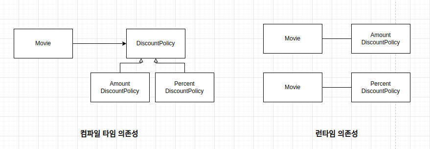
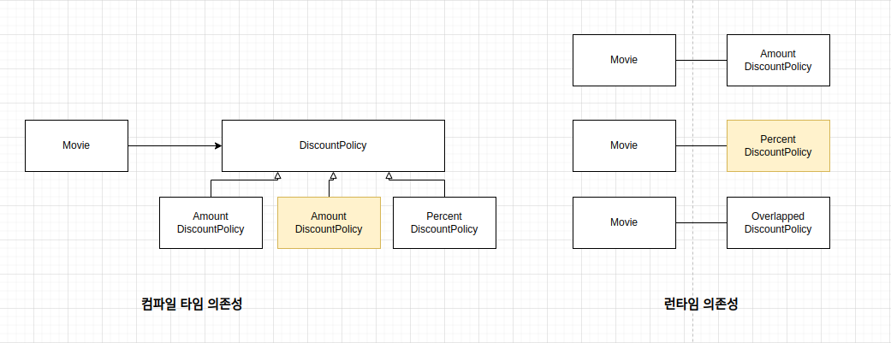
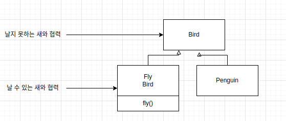

# Design smells 또는 Code smells

디자인 냄새는 마틴 파울러의 리팩토링 책에서 사용된 코드냄새에서 기인한다. 디자인 냄새는 기본 디자인 원칙을 위반하고 디자인 품질에 부정적인 영향을 미치는 구조이다.

디자인 냄새에는 4가지 종류가 있다.

### Rigidity 경직성

시스템이 변경하기 어렵다. 하나의 변경을 위해 다른 것들을 변경해야할때 경직성이 높다고 한다.

### Fragility 취약성

취약성이 높다면 시스템은 어떤 부분을 수정하였는데 관련이 없는 부분에도 영향을 미친다.

### Immobility 부동성

다른 부분에서 사용할 수 있는 컴포넌트를 떼어내는 것이 어렵다. 주로 개발자가 이전에 구현되었던 모듈과 비슷한 기능을 하는 모듈을 만드려고 할때 문제점을 발견한다.

### Viscosity 점착성

개발자가 디자인을 보존하는 코드를 시스템에 추가할 수 있는 용이성을 나타낸다. 프로그램 설계에 맞는 코드를 추가하는 것보다 해킹을 추가하는 것이 더 쉽다면 시스템의 점착성(점도)가 높은 것이다. 디자인을 유지하면서 프로그램에 새 코드를 추가하는 것이 쉽다면 점착성이 낮은 것이다.

# SOLID

디자인 냄새, 코드 냄새를 없애기 위해서 지켜야할 원칙이 있는데, 이는 5가지 원칙의 앞글자를 따서 SOLID로 표현한다.

## Single Responsibility Principal

<b>클래스는 오직 하나의 이유로 수정되어야 한다.</b>

<hr>

## Open Closed Principal

<b>클래스는 확장에는 열려있고 수정에는 닫혀있어야 한다.</b>

여기서 키워드는 확장과 수정이다.

- 확장에 대해 열려있다: 애플리케이션의 요구사항이 변경될 때 이 변경에 맞게 새로운 동작을 추가해서 애플리케이션을 확장할 수 있다.

- 수정에 대해 닫혀있다: 기존의 코드를 수정하지 않고도 애플리케이션의 동작을 추가하거나 변경할 수 있다.

사실 OCP는 런타임 의존성과 컴파일타임 의존성에 관한 이야기다. 런타임 의존성이란, 실행시에 협력에 참여하는 객체들 사이의 관계다. 컴파일 의존성은 코드에서 드러나는 클래스 사이의 관계다.



영화의 할인정책을 표현한 다이어그램이다. 컴파일타임 의존성 관점에서 Movie 클래스는 추상 클래스인 DiscountPolicy에 의존한다. 런타임 의존성 관점에서 Movie 인스턴스는 AmountDiscountPolicy와 PercentDiscountPolicy 인스턴스에 의존한다. 컴파일타임 의존성과 런타임 의존성은 동일하지 않다.

위의 설계는 이미 OCP를 따르고 있다. 위의 설계에서 중복할인 정책을 추가하는 케이스를 생각해보자.



위의 이미지와 마찬가지로 새로운 할인 정책을 추가해서 기능을 확장할 수 있다. 현재의 설계는 기존 코드를 수정할 필요 없이 새로운 클래스를 추가하는 것만으로 새로운 할인 정책을 확장할 수 있다. 이것이 OCP이다.

OCP를 수용하는 코드는 컴팡리타임 의존성을 수정하지 않고도 런타임 의존성을 쉽게 변경할 수 있다. 중복할인 정책을 구현하는 OverlappedDiscountPolicy 클래스를 추가하더라도 Movie 클래스는 여전히 DiscountPolicy 클래스에만 의존한다. 따라서 컴파일타임 의존성은 변하지 않는다. 하지만 런타임에 Movie 인스턴스는 OverlappedDiscountPolicy 인스턴스와 협력할 수 있다. 따라서 런타임 의존성은 변경되지 않는다. <b>의존성 관점에서 OCP를 따르는 설계란 컴파일 타임 의존성은 유지하면서 런타임 의존성의 가능성을 확장하고 수정할 수 있는 구조라고 할 수 있다.</b>

<hr>

## Liskov Substitution Principal

<b>베이스 클래스에서 파생된(상속한) 클래스는 베이스 클래스를 대체해서 사용할 수 있어야 한다.</b>

> 상속의 두 가지 목적

- 서브클래싱<br>
  다른 클래스의 코드를 재사용할 목적으로 상속을 사용하는 경우이다. 자식 클래스와 부모 클래스의 행동이 호환되지 않기 때문에 자식 클래스의 인스턴스가 부모 클래스의 인스턴스를 대체할 수 없다. 서브클래싱을 구현상속(implementation inheritance) 또는 클래스 상속(class inheritance)이라고 부르기도 한다.

- 서브타이핑<br>
  타입 계층을 구성하기 위해 상속을 사용하는 경우를 가리킨다. 서브타이핑에서는 자식 클래스와 부모 클래스의 행동이 호환되기 때문에 자식 클래스의 인스턴스가 부모 클래스의 인스턴스를 대체할 수 있다. 이때 부모 클래스는 자식 클래스의 슈퍼타입이 되고 자식 클래스는 부모 클래스의 서브타입이 된다. 서브타이핑을 인터페이스 상속(interface inheritance)이라고 부르기도 한다.

리스코프 치환 원칙을 한마디로 정리하면 "서브타입은 그것의 기반 타입에 대해 대체 가능해야 한다."는 것으로 클라이언트가 "차이점을 인식하지 못한 채 기반 클래스의 인터페이스를 통해 서브클래스를 사용할 수 있어야한다"는 것이다.

리스코프 치환 원칙에 따르면 자식 클래스가 부모 클래스와 행동 호환성을 유지함으로써 부모 클래스를 대체할 수 있도록 구현된 상속 관계만을 서브타이핑이라고 불러야한다.

<hr>

## Interface Segregation Principal

<b>사용하지 않는 메소드에 의존하면 안된다.</b>

> 상속은 언제 사용해야 할까?

상속은 타입 계층을 만들기 위해 사용한다. 그렇다면 어떤 조건을 만족시켜야 타입 계층을 위해 올바른 상속을 사용했다고 말할 수 있을까? 마틴 오더스키는 다음과 같은 질문을 해보고 두 질문에 모두 '예'라고 답할 수 있는 경우에만 상속을 사용하라고 조언한다.

- 상속 관계가 is-a 관계를 모델링하는가?<br>
  이것은 우리가 사용하는 '어휘'의 과점에 기반한다. 일반적으로 자식클래스는 부모클래스다라고 말해도 이상하지 않다면 상속을 사용할 후보로 간주할 수 있다.

- 클라이언트의 입장에서 부모 클래스의 타입으로 자식 클래스를 사용해도 무방한가?<br>
  상속 계층을 사용하는 클라이언트의 입장에서 부모 클래스와 자식 클래스의 차이점을 몰라야 한다. 이를 자식 클래스와 부모 클래스 사이의 행동 호환성이라고 부른다.

위의 두 가지 질문을 좀 더 자세히 살펴보자.

### is-a 관계

is-a 관계는 생각보다 직관적이지 않다. 새와 펭귄의 예를 들어 is-a 관계가 직관을 배신할 수 있다는 사실을 살펴보자.

- 펭귄은 새다.
- 새는 날 수 있다.

두 가지 사실을 조합하면 아래와 유사한 코드를 얻게 된다.

```java
public class Bird {
  public void fly() {}
}

public class Penguin extends Bird {

}
```

위의 코드는 반은 맞고 반은 틀리다. 펭귄은 분명 새지만 날 수 없는 새다. 하지만 코드는 분명히 "펭귄은 새고, 따라서 날 수 있다"라고 주장하고 있다.

이 예는 어휘적인 정의가 아니라 기대되는 행동에 따라 타입 계층을 구성해야 한다는 사실을 잘 보여준다. 어휘적으로 펭귄은 새지만 만약 새의 정의에 날 수 있다는 행동이 포함된다면 펭귄은 새의 서브타입이 될 수 없다. 만약 새의 정의에 날 수 있다는 행동이 포함되지 않는다면 펭귄은 새의 서브타입이 될 수 있다. 이 경우에는 어휘적인 관점과 행동 관점이 일치하게 된다.

즉, 타입 계층의 의미는 행동이라는 문맥에 따라 달라질 수 있다. 어떤 애플리케이션에서 새에게 날 수 있다는 행동을 기대하지 않고 단지 울음 소리를 낼 수 있다는 행동만 기대한다면 새와 펭귄을 타입 계층으로 묶어도 무방하다. 따라서 슈퍼타입과 서브타입의 관계는 is-a보다 행동 호환성이 더 중요하다.

### 행동 호환성

펭귄이 새가 아니라는 사실을 받아들이기 위한 출발점은 타입이 행동과 관련이 있다는 사실에 주목하는 것이다. 타입의 이름 사이에 개념적으로 어떤 연관성이 있다고 하더라도 (is-a 관계를 만족하다고 할지라도) 행동에 연관성이 없다면 is-a 관계를 사용하지 말아야 한다.

여기서 중요한 것은 행동의 호환 여부를 판단하는 기준은 클라이언트의 관점이라는 것이다. 클라이언트가 두 타입이 동일하게 행동할 것이라고 기대한다면 두 타입을 타입 계층으로 묶을 수 있다. 클라이언트가 두 타입이 동일하게 행동하지 않을 것이라고 기대한다면 두 타입을 타입 계층으로 묶어서는 안된다.

앞서 본 예시로 다시 돌아가서 생각해보면, Penguin은 Bird의 자식 클래스이기 때문에 Penguin은 fly 메서드를 사용할 수 있고, 이는 다시 말하면 클라이언트에서 fly 메서드를 호출할 수 있다는 것이다. 예상과 다르게 Penguin에서 호출한 fly 메서드는 동작하지 않을 것이므로 클라이언트의 기대를 저버리기 때문에 Bird의 서브타입이 아니다. 따라서 이 둘의 상속관계로 연결한 위 설계는 수정돼야 한다.

시도할 수 있는 방법은 세가지다.

- Penguin의 fly 메서드를 오버라이딩해서 내부 구현을 비워둔다.<br>
  Penguin.fly를 호출하더라도 아무일도 일어나지 않고, 아무것도 리턴하지 않는다. 따라서 Penguin은 날지 못한다. 하지만 이는 클라이언트가 기대한 행동이 아니므로 마찬가지로 올바른 설계라고 할 수 없다. 이 설계에서 Penguin과 Bird의 행동은 호환되지 않기 때문에 올바른 타입 계층이라고 할 수 없다.

  ```java
  public class Penguin extends Bird {
    @Override
    public void fly(){}
  }
  ```

- Penguin의 fly 메서드를 오바라이딩한 후 예외를 던진다.<br>
  이는 위와 마찬가지로 클라이언트 관점에서 Bird와 Penguin의 행동이 호환되지 않으므로 올바른 설계가 아니다.

  ````java
    public class Penguin extends Bird {
      @Override
      public void fly(){
        throw new UnsupportedOperationException();
      }
    }
  ```

  ````

- Fly 메서드를 수정해서 인자로 전달된 bird 타입이 Penguin이 아닌 경우에만 fly 메서드를 실행한다.<br>
  Penguin이외에 다른 날 수 없는 새가 상속 계층에 추가된다면? instanceof로 확인해야하는 코드를 추가해야한다. 이는 구체 클래스와의 결합도를 높인다. 또한 클래스를 추가할때마다 객체의 타입을 확인하는 코드를 추가/수정해야하므로 OCP를 위반한다.
  ```java
  public void flyBird(Bird bird) {
    if(!(bird instanceof Penguin)) {
      bird.fly();
    }
  }
  ```

위의 세가지 예시는 행동 호환성을 만족시키지 않는 상속계층을 그대로 유지한 채 클라이언트의 기대를 충족시키는 방법들을 살펴보았다. 그렇다면, 진짜 문제를 해결할 수 있는 방법은 클라이언트의 기대에 맞게 상속 계층을 분리하는 것이다.



<hr>

## Dependency Inversion Principal

<b>자신보다 변하기 쉬운 모듈에 의존해서는 안된다.</b>

> 고수준과 저수준?

- 고수준: 의미있는 단일 기능을 제공하는 상위 모듈로 쉽게 변화하지 않는다.
- 저수준: 고수준의 기능을 구현하기 위해 하위기능을 구현한 저수준 모듈이 필요하다. 비교적 자주 변경된다.

앞서 말한 것처럼 고수준 모듈이 잘 동작하려면 저수준 모듈을 사용해야한다. 다시 말하면, 고수준 모듈이 저수준 모듈에 의존하게 된다.

> 고수주이 저수준에 의존할때 생기는 문제

고수준 모듈이 저수준 모듈에 의존하게 되면 다음과 같은 세가지 문제점이 발생한다.

- 첫째, 테스트가 어렵다.<br>
  고수준 모듈을 테스트하기 위해서는 저수준 모듈이 모두 구현되어야만 한다.

- 둘째, 재사용성이 떨어진다.<br>
  고수준 모듈을 사용하기 위해서는 저수준 모듈도 함께 재사용해야한다.

- 셋째, 변경에 취약하다.<br>
  저수준 모듈을 변경하면 고수준 모듈도 함께 변경되어야한다.

이러한 문제를 해결하기 위한 방법이 바로 <b>추상화<b>이다.

> 추상화한 인터페이스를 활용한다.

다음 예시는 '가격할인 계산'이라는 기능을 구현하는 고수준 모듈 CalculateDiscountService이 추상화한 인터페이스인 RuleDiscounter를 의존하도록 의존성을 역전시킨 예시이다.

```java
// 고객 정보와 구매 정보에 룰을 적용해서 할인 금액을 구하는 규칙을 추상화한 인터페이스 (고수준!!)
public interface RuleDiscounter {
  Money applyRules(Customer customer, List<OrderLine> orderLines);
}

// 고수준 모듈이 추상화한 인터페이스에 의존하도록 변경 (고수준!!)
public class CalculateDiscountService {
  private RuleDiscounter ruleDiscounter;

  public CalculateDiscountService(RuleDiscounter ruleDiscounter) {
    this.ruleDiscounter = ruleDiscounter;
  }

  public Money calculateDiscount(List<OrderLine> orderLines, String customerId) {
    Customer customer = findCustomer = findCustomer(customerId);
    return ruleDiscounter.applyRules(customer, orderLines);
  }
}


// 고수준 모듈인 RuleDiscounter의 구현한 모듈 (저수준 모듈!!)
public class DroolsRuleDiscounter implements RuleDiscounter {
  private KieContainer kContainer;

  public DroolsRuleEngine() {
    KieServices ks = KieServices.Factory.get();
    kContainer = ks.getKieClasspathContainer();
  }

  @Override
  public Money applyRules(Customer customer, List<OrderLine> orderLines) {
    KieSession kSession = kContainer.newKieSession("discountSession");
    try {
      //코드 생략
      kSession.fireAllRules();
    } finally {
      kSession.dispose();
    }
    return money.toImmutalbeMoney();
  }
}
```
