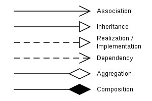

# 클래스 다이어그램

## UML

UML이란 Unified Modeling Lanaguage의 약자로 1997년 Object Management Group에서 표준으로 채택한 통합모델링 언어이다. 즉, 모델을 만드는 표준언어이다.

UML은 구조 다이어그램 7개, 행위 다이어그램 7개로 총 14종류의 다이어그램이 있다. 구조 다이어그램은 시스템의 관계와 개념의 측면에서 요소들을 나타내고, 각 요소들의 정적인 면을 보기 위한 것이다. 행위 다이어그램은 각 요소들간의 변화나 흐름, 주고받는 데이터 등의 동작을 보기 위한 것이다.

클래스 다이어그램은 그 중에서 구조 다이어그램에 해당한다. 클래스 다이어그램은 클래스 내부의 정적인 내용이나 클래스 사이의 관계를 표기하며, 시스템 일부 또는 전체의 구조를 나타낼 수 있다.
클래스 간 의존 관계를 명확히 표현하며, 순환 의존이 발생하는 지점을 찾아 어떻게 이 순환 고리를 깨는 것이 가장 좋은지 결정할 수 있게 한다.

## 클래스 다이어그램의 요소

 

> ## Class

 

클래스는 이름, 속성, 기능 등 세 부분으로 나누어 표기할 수 있다. 글래스 내부에는 접근제한자, 데이터타입, 매개변수, 리턴 타입 등을 나타낼 수 있다. 클래스의 세부사항들을 상세하게 적는 것이 유용할 때도 있지만, UML 다이어그램은 필드나 메서드를 모두 선언하는 곳이 아니기 때문에 다이어그램을 그리는 목적에 필요한 것만 사용하는 것이 좋다.

 

> ## Stereo Type

 

스테레오 타입이란 UML에서 제공하는 기본 요소 외에 추가적인 확장요소를 나타내는 것으로 길러멧 (<>)사이에 적는다. 스테레오 타입으로 가장 많이 사용되는 것은 interface, utility, abstract, enumeration 등이 있다.

 

> ## Abstract Class

 

추상클래스란 1개 이상의 메서드가 구현체가 없고 명세만 존재하는 클래스를 말한다.

 

> ## 클래스 간의 관계

 

클래스 다이어그램의 주 목적은 클래스 간의 관계를 한눈에 보기 쉽게 표현하고 의존 관계를 파악하는 것에 있다. 그렇기 때무누에 클래스 다이어그램에서 가장 중요한 것이 클래스간의 관계이다.

 

### Association

다른 객체의 참조를 가지고 있을때 이러한 연관관게를 나타낸다. 방향이 있는 실선(A->B)은 A가 B를 참조한다는 의미이다. 방향이 없는 실선(A-B)은 A가 B를, B가 A를 참조할 수도 있고 두 ㄹ다 참조이거나 둘 다 참조가 아니라는 의미이다.

### Generalization 또는 Inheritance

상속관계를 나타낸다. 부모 클래스와 자식 클래스 간의 상속 관계를 나타낼때 사용한다.
Bus와 Car, Truck은 Vehicle이라는 부모 클래스로부터 상속받은 자식 클래스이다. Vehicle은 이동수단이 갖는 속성과 메소드를 가지고 있으며, 상속받은 자식 클래스들은 이러한 속성을 공유한다.

### Realization

인터페이스를 상속하여 클래스에서 실제 기능을 실현화할때 사용한다. 인터페이스로 명세화 된 기능을 실제 기능으로 구현하는 것을 말한다.

### Dependency

클래스가 다른 클래스와의 의존성을 가지고 있는 경우이다. 즉, 지역변수로만 사용하거나, 메서드 반환에 사용하거나 파라미터로 사용하는 등 멤버 변수로 갖지 않고 사용하는 관계이다. Association은 다른 클래스를 멤버 변수로 할당할때 사용한다.

### Aggregation

Association의 한 종류이며 전체와 부분의 관계를 가지는 클래스에 적용된다. 멤버 변수로 다른 클래스를 가지고 있지만, new를 직접하지 않는다.

### Composition

Association의 한 종류이며 전체와 부분의 관계를 가지는 클래스에 적용된다. 멤버 변수로 다른 클래스를 가지고 있고, new를 하는 관계이다.

 

### reference

- <a href="https://stackoverflow.com/questions/50088915/what-is-a-stereotype-in-unified-modelling-language">What is a Stereotype in Unified Modeling Language</a>
