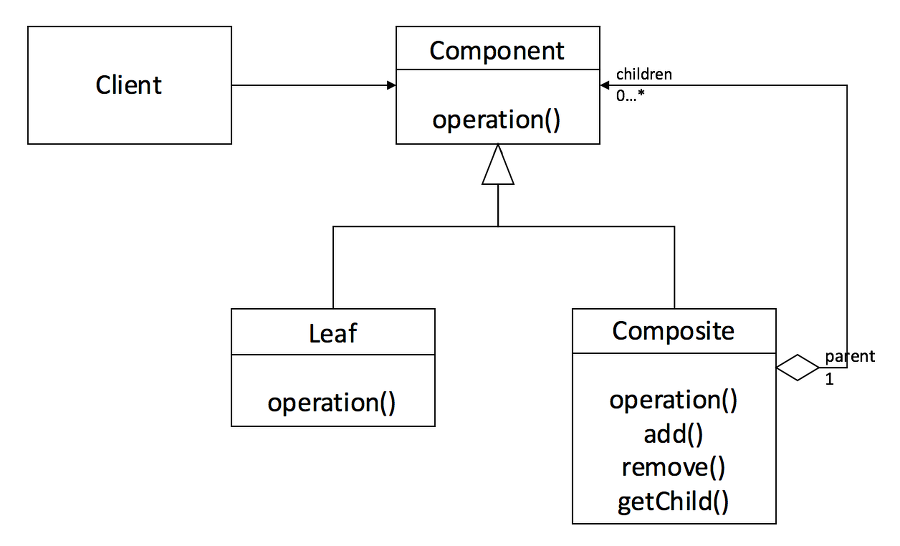

# 복합체

복합체 패턴은 객체들을 트리 구조로 구성한 후, 이러한 구조들을 개별 객체들처럼 다룰 수 있도록 하는 구조 패턴이다. 전체 트리 구조에 대해 <b><u>재귀적으로</u></b> 메서드를 실행하고 결과를 <b><u>요약</u></b>하는 기능은 복합체의 훌륭한 기능 중 하나이다.

아래의 이미지를 보면 클라이언트는 단일 객체인 Leaf와 복합객체(group of objects)를 Component라는 인터페이스를 통해 동일하게 조작하는 것을 알 수 있다.

Client 클래스는 Leaf와 Compoiste 클래스를 직접 참조하지 않고, 추상화된 개념으로써 공통 인터페이스인 Component를 참조한다. Leaf 클래스는 Component 인터페이스를 구현한 구체 클래스이다. Composite 클래스는 Leaf 클래스와 마찬가지로 Component 인터페이스를 구현하며, Leaf와 Composite을 자식으로 가진다. 또한, 일반적으로 인터페이스에 작성된 메서드는 자식에게 위임한다.



<br>

## 복합체 예시

```js
abstract class Component {
  protected parent!: Component | null;

  public setParent(parent: Component | null) {
    this.parent = parent;
  }

  public getParent(): Component | null {
    return this.parent;
  }

  public add(component: Component):void {}

  public remove(component: Component):void {}

  public isComposite(): boolean {
    return false;
  }

  public abstract operation(): string;
}

class Leaf extends Component {
  public operation(): stirng {
    return 'Leaf';
  }
}

class Composite extends Component {
  protected children: Component[] = [];

  public add(component: Component): void {
    this.children.push(component);
    component.setParent(this);
  }

  public remove(component: Component): void {
    const componentIndex = this.children.indexOf(component);
    this.children.splice(componentIndex, 1);

    component.setParent(null);
  }

  public isComposite(): boolean {
    return true;
  }

  public operation(): string {
    const results = [];
    for(const children of this.children) {
      results.push(children.operation());
    }
    return `Branch(${results.join('+')})`;
  }
}

function clientCode(component: Component) {
  console.log(`RESULT: ${component.operation()}`);
}

const simple = new Leaf();
console.log('Client: I\'ve got a simple component:');
clientCode(simple);

const tree = new Composite();
const branch1 = new Composite();
const branch2 = new Composite();
branch1.add(new Leaf());
branch1.add(new Leaf());
branch2.add(new Leaf());
tree.add(branch1);
tree.add(branch2);
console.log('Client: Now I\'ve got a composite tree:');
clientCode(tree);

function clientCode2(component1: Component, component2: Component) {
  if(component1.isComposite()) {
    component1.add(component2);
  }
  console.log(`RESULT: ${component1.operation()}`);
}

console.log('Client: I don\'t need to check the component classes even when managing the tree:');
clientCode(tree, simple);
```
