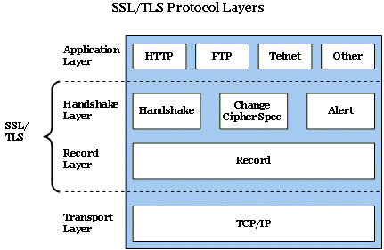
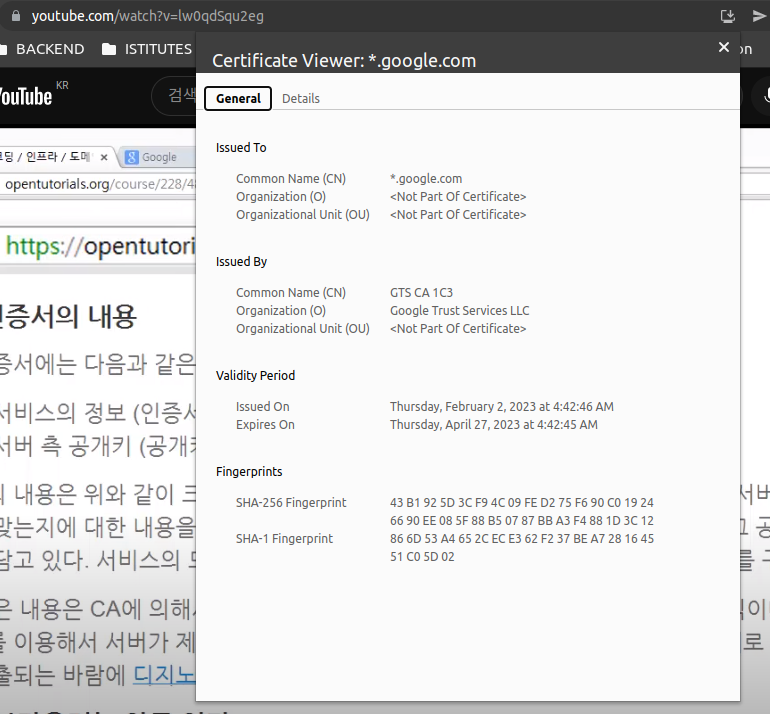

l# HTTPS (Hypertext Transfer Protocol Secure)

HTTPS에서 마지막 S는 Over Secure Socket Layer의 약자로 Secure라는 말에서 알 수 있듯이 보안이 강화된 HTTP이다.
HTTP는 암호화되지 않은 데이터를 전송하므로 로그인 시에 비밀번호를 탈취하거나 데이터를 변조할 수 있다. 이러한 문제를 보안한 것이 HTTPS이다.

<hr>

## HTTPS와 SSL(Secure Socket Layer), TLS(Transport Layer Security)

</a>

HTTPS는 SSL(TLS) 레이어 위에서 HTTP 통신이 이루어지는 것을 말한다. SSL 레이어 위해서 FTP 통신이 이루어지면, 이는 SFTP라고 한다. SSL과 TLS는 같은 것이다.

네스케이프에 의해 SSL이 발명되었고, 폭넓게 사용되다가 TLS라는 이름으로 바뀌었다. TLS 1.0은 SSL 3.0을 계승한다. TLS라는 이름보다 SSL으로 훨씬 많이 사용되고 있다.

<hr>

## SSL 디지털 인증서

SSL 인증서는 클라이언트오 서버 간의 통신을 제 3자가 보증해주는 전자화된 문서다. 이 인증서를 통해 다음과 같은 이점을 얻을 수 있다.

- 암호화를 통해 통신 내용이 공격자에게 노출되는 것을 막을 수 있다.
- 클라이언트가 접속하려는 서버의 신뢰성을 판단할 수 있다.
- 통신 내용의 악의적인 변조를 방지할 수 있다.

<hr>

## OpenSSL로 암호화 해보기

- openssl이란, 데이터 통신을 위해 TLS, SSL 프로토콜을 이용할 수 있는 오픈소스 라이브러리이다.

다음은 대칭키를 생성하고 대칭키로 텍스트파일을 암호화하는 과정이다.

```bash
~/ssl  echo 'this is the plain text' > plaintext.txt
~/ssl  ls -al
total 12
-rw-rw-r--  1 2월 21 22:46 plaintext.txt

~/ssl  cat plaintext.txt
this is the plain text

~/ssl  openssl enc -e -des3 -salt -in plaintext.txt -out ciphertext.bin;
enter des-ede3-cbc encryption password:
Verifying - enter des-ede3-cbc encryption password:

*** WARNING : deprecated key derivation used.
Using -iter or -pbkdf2 would be better.

~/ssl  cat ciphertext.bin
Salted__m�EV�\�:1]h;�衹�9�|!�>lh^%
```

다음은 비대칭키를 만들어서 public key로 파일을 암호화하고, private 키로 다시 복호화하는 과정이다.

다음과 같이 public key로 암호화하고 private key로 복호화하면, 데이터 보안을 목적으로 비대칭키를 사용하는 것이다.

<u>반대로도 활용할 수 있는데, <b>private key로 암호화하고 public key로 복호화</b>하면, 이는 데이터를 전송하는 측의 신워을 보장하는 즉, <b>인증</b>의 수단으로 사용할 수 있다.</u>

```bash
~/ssl  openssl genrsa -out private.pem 1024
Generating RSA private key, 1024 bit long modulus (2 primes)
..........+++++
.......................+++++
e is 65537 (0x010001)

~/ssl  openssl rsa -in private.pem -out public.pem -outform PEM -pubout;
writing RSA key

~/ssl  echo 'coding everybody' > file.txt
~/ssl  ls
ciphertext.bin  file.txt  plaintext.txt  private.pem  public.pem
~/ssl  cat file.txt
coding everybody

~/ssl  openssl rsautl -encrypt -inkey public.pem -pubin -in file.txt -out file.ssl;
~/ssl  cat file.ssl;
E�|L��j��m�g��I�������΀�d�
 �ܡ�o���f�)~3�            ��j�#!j8g%�c��R���zb�
��U��c����q�
            |�J}*���l?+P�N�>k|��iC�;�Y�\5(tA��b�%

~/ssl  openssl rsautl -decrypt -inkey private.pem -in file.ssl -out decrypted.txt;
~/ssl  cat decrypted.txt;
coding everybody

```

## SSL 인증서

### 인증서의 목적

> - 클라이언트(브라우저)가 접속한 서버가 신뢰할 수 있는 서버임을 보장한다.
> - SSL 통신에 사용할 공개키를 클라이언트(브라우저)에게 제공한다.

### CA (Certificate Authority)

SSL을 통해 암호화된 통신을 제공하려면, CA를 통해서 인증서를 구입해야한다. CA는 엄격한 기준으로 선정된 공인된 기업들만 참여할 수 있다.

사설 인증기관도 존재하는데, 개발이나 사적인 목적을 위해 SSL의 암호화 기능을 이용하려 한다면, 자신이 직접 SSL 역할을 할 수도 있다.

이는 공인된 인증서가 아니기 때문에 이러한 사설 CA 인증서를 이용하는 경우 브라우저는 경고를 출력한다.

### 인증서에 포함된 내용

> - 서비스의 정보 (인증서를 발급한 CA, 서비스 도메인 등)
> - 서버 측 공개키 (서비스 공개키, 공개키의 암호화 방법 등)


ea
- 브라우저는 모든 CA 리스트와 CA의 공개키를 가지고 있다.

- 서버는 브라우저와 통신을 시작할때, 자신의 인증서를 전송한다. 브라우저는 전달받은 인증서의 CA가 내장된 CA 리스트에 있는지 확인하고, 있다면 브라우저에 내장된 해당 CA 공개키로 전달받은 인증서를 복호화한다.

- 복호화에 성공했다면, CA의 비밀키에 의해 암호화된 것이 맞다는 것을 확인할 수 있다.

- 인증서 내에는 서비스의 공개키가 포함되어 있다.

- 클라이언트와 서버는 데이터를 암호화, 복호화하기 위해 공개키와 대칭키를 혼합해 통신한다.

<hr>

## SSL 동작과정

다시 정리해보면, 클라이언트와 서버는 '대칭키'를 사용해서 데이터를 암호화, 복호화해서 통신하고 (비대칭키는 시간과 부하가 많이 걸리는 작업이기 때문), 이때 사용하는 대칭키는 공개키 방식으로 암호화해서 클라이언트와 서버가 공유한다.

이렇게 대칭키를 만들어서 공유하고 데이터를 송수신하고 세션을 종료하기까지의 과정을 살펴보자.

### Handshake

> ### Client Hello

- 클라이언트에서 생성한 랜덤 데이터
- 클라이언트가 지원하는 암호화 방식
- 세션 아이디(이미 핸드쉐이킹을 했다면 비용과 시가을 절약하기 위해 기존의 세션을 재활용하는데, 이 때 사용할 연결에 대한 식별자를 서버 측으로 보낸다.)

> ### Server Hello

- 서버 측에서 생성한 랜덤 데이터
- 서버가 선택한 클라이언트의 암호화 방식
- 인증서

> ### 클라이언트: 인증서 확인 및 pre master secret 생성

- 클라이언트는 인증서가 CA에 의해 발급된 것인지 확인하기 위해 클라이언트에 내장된 CA 리스트를 확인하고, 리스트에 없다면 사용자에게 경고 메시지를 출력한다.

- 인증서가 CA에 의해 발급된 것인지 확인하기 위해 클라이언트에 내장된 CA의 공개키를 이용해 인증서를 복호화한다. 복호화되었다면, CA의 개인키로 암호화된 문서임이 보증되므로 인증서를 전송한 서버를 신뢰할 수 있다. 복호화된 인증서에는 서버의 개인키가 포함되어있다.

- 클라이언트는 자신과 서버가 각각 생성한 랜덤 데이터를 조합해서 pre master secret이라는 키를 생성한다. pre master secret은 인증서 속에 포함되어있는 서버의 공개키로 암호화해서 서버로 전송한다.

> ### 서버: pre master secret 복호화

- 서버는 클라이언트가 전송한 pre master secret을 자신의 비공개키로 복호화한다. 결과적으로 클라이언트와 서버 모두 pre master secret 값을 공유하게 되었다. 클라이언트와 서버는 일련의 과정을 거쳐 master secret을 생성한다. master secret은 세션키를 생성하는데 이 세션키를 사용해서 서버와 클라이언트를 데이터를 대칭키 방식으로 암호화해 주고 받는다.

> ### Handshake 종료

- 클랄이언트와 서버는 핸드쉐이크 단계의 종료를 서로에게 알린다.

> ### Session 시작과 종료

- 클라이언트와 서버는 공유하는 세션키로 데이터를 암호화, 복호화한다.
- 데이터 전송이 끝나면 SSL 통신이 끝났음을 서로에게 알린다.
- 이때, 통신에서 사용한 대칭키는 세션키를 폐기한다.

<br><br>

> ### reference

- <a href="https://www.youtube.com/watch?v=0cfUVrQW_yg&t=10s">https와 ssl이란 무엇인가</a>
- <a href="https://www.youtube.com/watch?v=dabaJY3Q3Og&t=1s">대칭키2</a>
- <a href="https://www.youtube.com/watch?v=lw0qdSqu2eg">인증서 용어정리</a>
