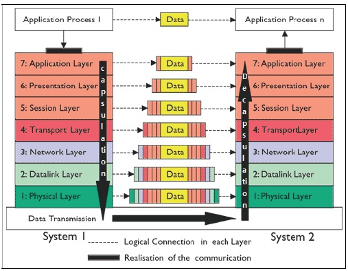

# OSI 7계층

OSI 7계층은 네트워크 통신이 일어나는 과정을 7단계로 나눈 것이다.

### 1 Physical Layer

데이터는 0과 1의 비트열로 이루어져있다.
1계층에서는 데이터 전달의 역할만 한다.
전송 단위는 비트이다.
장비로는 케이블, 리피터, 허브가 있다.

### 2 Data-Link Layer (frame)

같은 네트워크에 있는 여러대의 컴퓨터들이 데이터를 주고받기 위해 필요한 모듈(함수)로 다른 네트워크는 고려하지 않는다.

송신자는 데이터 앞뒤에 특정한 비트열을 붙여 시작과 끝을 표시하며, 비트열이 붙은 데이터가 하나의 데이터 단위이고 이를 프레임이라고 한다.
2계층에서는 encoder에서 데이터를 프레이밍하고, 동일한 네트워크의 다른 컴퓨터에게 보내면, decoder를 통해 프레이밍이 제거된 원본 데이터를 확인한다.
흐름제어(flow control)
송신자와 수신자의 처리 속도 간 차이를 해결한다.
에러제어(error control)
송신측에서 framing한 비트열을 보내면 수신측에서는 비트 배열을 받게 되는데, 이 전기적 신호들은 취약하기 때문에 변형되거나 손실될 수 있으므로, 2계층에서 에러를 검출한다. 2계층에서는 검출된 에러를 직접 수정하거나, 송신측에 데이터를 다시 보내달라고 요청할 수 있다.
이때 컴퓨터는 MAC 주소를 통해 통신한다.
MAC 주소는 2계층에서 통신을 위한 네트워크 인터페이스에 할당된 고유 식별자이다.
데이터 단위는 프레임이다.
랜카드(하드웨어)에 구현되어있다.

### 3 Network Layer (packet)

Transport Layer으로부터 전달받은 segment에 source IP 주소, destination IP 주소, TTL, identification 등의 필드가 저장된 헤더를 추가하여 Packet을 만든다.

다른 네트워크에 있는 컴퓨터와 데이터를 주고받기 위해 필요한 모듈(함수)
컴퓨터끼리 통신하기 위해서는 송신자 컴퓨터는 수신자 컴퓨터의 IP주소를 알아야한다.
3계층에서는 IP주소를 사용해 길을 찾고(routing), 다음 라우터에게 데이터를 넘겨준다(forwarding)
송신자 컴퓨터는 자신이 연결된 A 라우터에 데이터 패킷(IP주소와 데이터가 저장된 객체)을 전달한다. A 라우터는 데이터 패킷을 열어 IP주소를 확인하고(decoding), 자신에 연결된 컴퓨터들 중에 해당 IP 주소가 없다면, 다시 encoding 시켜 연결된 B 라우터에게 데이터 패킷을 전달한다. B 라우터에 decoding해 확인한 IP 주소의 컴퓨터가 있다면, 그 컴퓨터에게 데이터 패킷을 전달한다.
라우팅 기능을 맡고있는 계층인만큼 최적의 경로를 설정해 데이터를 보낸다.
데이터 단위는 패킷이다.
운영체제의 커널에 소프트웨어적으로 구현되어있다.

### 4 Transport Layer (segment)

네트워크 통신은 메시지 기반으로 이루어진다. 하지만, 파일을 다운로드받는 경우를 생각해보면, 하나의 메시지로 한번에 짠하고 이루어지지 않는다. 파일은 여러개의 chunk로 나누어져 다운로드되는데, 이 과정이 일어나는 곳이 Transport Layer의 TCP 프로토콜에서 일어난다.

포트번호를 사용해 도착지 컴퓨터의 최종 도착지인 프로세스까지 데이터가 도달하게 하는 모듈
대표적으로 자주 사용하는 TCP, UDP 프로토콜이 있는 계층이다.
데이터 전송단위는 TCP는 Segment, UDP는 Datagram이다.
운영체제의 커널에 소프트웨어적으로 구현되어있다.

### 5 Session Layer

두 응용 프로세스가 통신을 관리하기 위한 방법을 제공한다.

양쪽 네트워크의 연결을 관리하고, 연결을 지속시켜준다.
세션을 만들고, 유지하며, 세션 종료, 복구 등의 기능이 있다.

### 6 Presentation Layer

데이터를 어떻게 표현할지 정하며 MIME 인코딩이나 암호화 등이 이 계층에서 이루어진다.

송신자에게 온 데이터를 해석하기 위한 데이터 부호화(Translation: ASCII->EBCDIC)
수신자가 압축을 풀 수 있는 방식으로 데이터 압축 (Data Compression)
데이터의 암호화와 복호화 (Encryption, Decryption)

### 7 Application Layer

크롬, 파이어폭스, 스카이프 등의 인터넷을 사용하는 애플리케이션 등이 있으며, 크롬과 파이어폭스 등의 웹 브라우저는 HTTP, HTTPS 프로토콜을 사용하며, 그 외에도 FTP(파일전송), SMTP(이메일) 등이 있다.

응용 프로세스 간의 정보 교환
