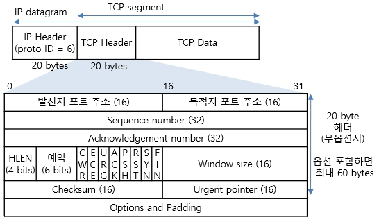

# TCP (Transfer Control Protocol) IP (Internet Protocol)

TCP란, 두 개의 호스트를 연결하고 데이터 스트림을 교환하게 해주는 네트워크 프로토콜이다. 즉, 한 기기에서 다른 기기로 데이터 전송을 담당한다. IP는 데이터 조각을 최대한 빨리 대상 IP 주소로 보내는 역할을 한다.

즉, IP 주소 체계를 따르고 IP Routing을 이용해 목적지에 도달하면 TCP의 특성을 활용해 송신자와 수신자의 논리적 연결을 생성하고 신뢰성을 유지할 수 있도록 하겠다는 것을 의미한다.

인터넷에서 무언가를 다운로드할때, 중간에 끊기거나 빠지는 부분없이 완벽하게 받을 수 있는 것도 TCP의 특성 덕분이다. 따라서 TCP는 HTTP, HTTPS, FTP, SMTP 등의 프로토콜의 기반이 된다.

# TCP

TCP는 OSI 7계층 중 4계층(Network)에 속한다. 양쪽 단말이 통신할 준비가 되었는지, 데이터가 제대로 전송되었는지, 데이터가 변질되지는 않았는지, 수신자가 잘 받았고, 빠진 부분은 없는지 등을 점검한다. 이런 정보는 TCP 헤더에 담겨있다. TCP 헤더에는 SYNC, ACK, FIN, RST, Source Port, Destination Port, Sequence Number, Window size, Checksum과 같은 신뢰성 보장과 흐름 제어, 혼잡 제어에 관여할 수 있는 요소들도 포함되어있다.

TCP는 포트를 이용해 연결하는데, 이는 단말의 입구를 의미한다. 양쪽 단말이 HTTP 통신할 경우, 80번 포트로 연결해야한다.

 

# 3-Way Handshake

TCP를 사용해 데이터를 송수신하기 전에 먼저 서로 통신이 가능한지 의사를 묻고 한 번에 얼마나 받을 수 있는지 등의 정보를 확인한다.

> ### step 1 (SYN)

클라이언트는 연결요청 메시지(SYN)를 전송한다. 이때, SYN 플래그 비트는 1이며, 랜덤한 숫자의 Sequence Number x를 함께 전송한다.

> ### step 2 (SYN + ACK)

서버가 SYNC(x)를 받고 요청을 수락한다는 신호로 ACK와 SYN 패킷을 보낸다. 이때, SYN의 Sequence Number는 y, Acknowledge Number는 x+1로 설정한다.

> ### step 3

클라이언트는 ACK(x+1)과 SYN(y) 패킷을 받고, ACK(y+1)을 서버로 보낸다.

   
reference

- <a hrref="http://www.ktword.co.kr/test/view/view.php?m_temp1=1889">정보통신기술용어해설</a>

- <a href="https://aws-hyoh.tistory.com/entry/TCPIP-%EC%89%BD%EA%B2%8C-%EC%9D%B4%ED%95%B4%ED%95%98%EA%B8%B0">네트워크 엔지니어 환영의 기술블로그</a>
