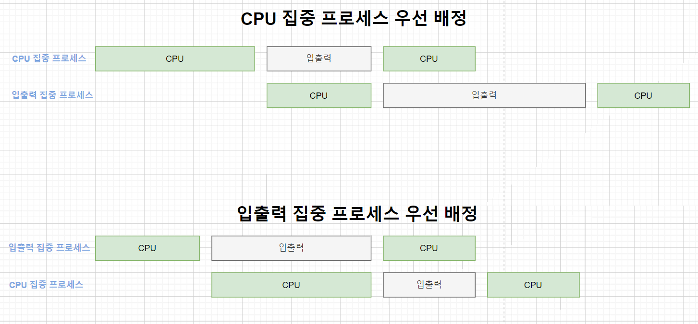

# CPU 스케줄링

프로세스는 생성, 준비, 실행, 대기와 같은 여러 상태를 거치며 작업이 이루어진다. CPU 스케줄러는 프로세스가 생성된 후 종료될때까지 모든 상태 변화를 조정한다. (CPU 스케줄러는 프로세스 스케줄러라고도 한다.) 스케줄링은 여러 프로세스의 상황을 고려해 CPU와 시스템 자원을 어떻게 배정할 지 결정하는 일을 말한다.

## 스케줄링 목적

<u>CPU 스케줄링의 원래 목적은 모든 프로세스가 공평하게 작업하도록 하는 것</u>이다. 특정 프로세스에 편중되지 않게 골고루 자원을 배분하기 위해 공평성을 유지하면서도 안정적으로 작동해야 한다. 즉, 특정 프로세스가 시스템 자원을 독점, 파괴하는 것을 막기 위해 중요도에 따라 우선순위를 배정해야 한다. 또한 시스템 자원을 효율적으로 배분하여 전체적인 시스템의 성능도 높여야 한다. 확장성도 고려해야 하는데, 확장성은 프로세스의 개수가 증가해도 성능에 갑작스러운 변화가 없어야 함을 의미한다.

<u>보통은 모든 프로세스가 공평하게 CPU를 할당받아야 한다. 그러나 시스템의 안정성과 효율성을 높이기 위해 다른 프로세스보다 먼저 처리해야 하는 프로세스가 있으므로 <b>CPU 스케줄러는 일정 부분 공평성을 희생</b>한다.</u> 일반적으로 <u>운영체제 프로세스는 일반 프로세스보다 우선적응로 CPU를 배정받는다. 또한 일반 프로세스 간에도 <b>우선순위</b>에 따라 CPU 배정 순서가 달라진다.</u>

## 식당 관리자의 스케줄링

대부분의 식당은 주방과 홀이 분리되어 있다. 요리사는 주방에서 요리를 하고, 식당관리자는 주문을 받아 주방에 전달하거나 예약, 좌석, 주문, 조리 순서, 손님 요청관리 등을 담당한다. 

식당 관리자는 주문과 관련해 크게 두 가지 일을 한다.

    1. 좌석 관리
    예약 손님을 고려해 자리를 여유분으로 남겨두기도 하고, 주방 및 재료 상황 식당 규모 등을 파악해 적당한 인원에게 자리를 배정할 수 있도록 한다. (재료가 소진되면 더 이상 손님을 받지 않아야하니까) 전체 좌석 수, 실시간 좌석 배정, 여유 좌석 배분같이 큰 틀에서 좌석을 관리하는 것이다.

    2. 조리 순서 관리
    자리를 배정받은 손님을 대상으로 이루어지는 작은 틀에서의 관리이다. 어떤 손님은 막 주문하기 시작했고, 어떤 손님은 메인 요리를 먹고 있고, 또 어떤 손님은 디저트를 먹어야할 시점일 것이다. 손님은 제각기 식사 속도도 다르고, 주문하는 메뉴도 다르다. 따라서 식당 관리자는 손님들의 다양한 상황을 고려해 요리가 나가는 순서와 속도를 관리해야 한다.

식당 관리자가 큰 틀에서 관리와 작은 틀에서의 관리를 병행하듯이 CPU 스케줄러도 관리 범주는 나누어 스케줄링을 한다. CPU 스케줄링은 규모에 따라 고수준, 중간 수준, 저수준으로 구분된다.

## 고수준 스케줄링 (high level / long-term / job / admission scheduling)

많은 작업을 동시에 하면 시스템에 과부하가 걸려 작업이 원활하게 이루어지지 않는다. 이는 식당 관리자가 주방 상황을 고려하지 않고 무조건 손님을 많이 받으면 요리를 제공하는 데 문제가 생기는 것과 다름없다.

<u>고수준 스케줄링은 시스템 내의 <b>전체 작업 수를 조절</b>하는 것</u>을 말한다. 여기서 <u>작업은 운영체제에서 다루는 일의 가장 큰 단위로, 1개 또는 여러 개의 프로세스로 이루어진다.</u> 고수준 스케줄링 단계에서는 어떤 작업을 시스템이 받아들일지 또는 거부할지를 결정한다. 일단 작업이 시작되면 시스템 자원을 사용하기 때문에 기존 작업에 영향을 미친다. 작업 요청이 오면 스케줄러가 시스템의 상황을 고려해 작업을 승인할지, 거부할지를 결정하므로 고수준 스케줄링을 승인 스케줄링(admission scheduling)이라고도 한다. 고수준 스케줄링에 따라 시스템 내에서 동시에 실행 가능한 프로세스의 총 개수가 정해진다.

## 저수준 스케줄링 (low level / short-term scheduling)

고수준 스케줄링과 반대로 <u>가장 작은 단위의 스케줄링을 저수준 스케줄링</u>이라고 한다. 고수준 스케줄링이 전체 손님 수를 조절하는 단계라면, 저수준 스케줄링은 각 손님의 주문과 그에 따른 요리 제공 순서를 미세하게 조절하는 단계이다.

CPU 스케줄러 입장에서 저수준 스케줄링은 어떤 프로세스에 CPU를 할당할지, 어떤 프로세스를 대기 상태로 보낼지 등을 결정하는 일이다. 준비 상태에 있는 프로세스 중 하나를 골라 실행 상태로 보내고, 실행 상태에 있는 프로세스를 대기 상태로 보내며, 대기 상태의 프로세스를 준비 상태로 보내는 것을 예로 들 수 있다. 저수준 스케줄링은 아주 짧은 시간에 잃어나기 때문에 단기 스케줄링이라고도 부른다. 

## 중간 수준 스케줄링 (min level scheduling)

<u>중간 수준 스케줄링은 고수준과 저수준 사이에 일어나는 스케줄링</u>이다. 고수준 스케줄링이 프로세스를 활성화할지 말지를 결정해 전체 프로세스의 수를 조절하는 방식이지만, 프로세스가 활성화된 후에도 여러 가지 사정으로 시스템에 과부하가 걸릴 수 있다. 이는 식당 관리자의 판단에 따라 좌석 수를 결정하고 거기에 맞게 손님을 받았는데, 하필 모든 손님이 조리 시간이 긴 코스 요리를 주문한 경우에 비유된다. 이럴 때 식당 관리자는 시간이 덜 걸리는 코스 요리로 변경하도록 유도하거나 주문을 천천히 받는다. 

<u>중간 수준 스케줄링은 중지와 활성화로 전체 시스템의 <b>활성화된 프로세스 수를 조절</b>하여 과부화를 막는다.</u> 즉 일부 프로세스를 중지 상태로 옮김으로써 나머지 프로세스가 원만하게 작동하도록 지원한다. 이는 프로세스의 상태 중 보류에 해당하며, 저수준 스케줄링이 원만하게 이루어지도록 완청하는 역할을 한다.

## 스케줄링 시 고려 사항

CPU 스케줄러가 어떤 프로세스에 우선적으로 CPU를 할당할지 결정해야 할 때 고려할 사항이 있다. 

### 선점형 vs 비선점형

|구분|선점형|비선점형|
|:---|:---|:---|
|작업 방식|실행 상태에 있는 작업을 중단시키고 새로운 작업을 실행한다|실행 상태에 있는 작엄이 완료될떄까지 다른 작업 불가능하다|
|장점|프로세스가 CPU를 독점할 수 없어 대화형이나 시분할 시스템에 적합|CPU 스케줄러의 작업량이 적고 문맥 교환의 오버헤드가 적다|
|단점|문맥 교환 오버헤드가 많다|기다리는 프로세스가 많아 처리율이 떨어진다|
|사용|시분할 방식 스케줄러에 사용된다|일괄 작업 방식 스케줄러에 사용된다|
|중요도|높다|낮다|

선점형 스케줄링 방식의 스케줄러에도 비선점형 프로세스가 있을 수 있다. 예를 들어 시스템을 백업하는 프로세스는 비선점형으로 작동한다. 비선점형과 선점형 프로세스가 혼재하는 경우에는 비선점형 프로세스의 중요도를 매우 낮게 설정해 선점형 프로세스에 영향을 덜 미치도록 한다.

### 프로세스 우선순위

대부분의 CPU 스케줄러는 우선순위를 사용한다. 우선순위가 있다는 것은 프로세스의 중요도가 다르다는 의미이다. (예약 손님이 일반 손님보다 우선 순위가 높은 것처럼)

프로세스는 크게 커널 프로세스와 일반 프로세스로 나뉘는데, 커널 프로세스가 일반 프로세스보다 우선순위가 높다. 

우선순위가 높다는 것은 더 빨리 자주 실행된다는 의미이다. 준비 상태의 커널 프로세스와 일반 프로세스가 하나씩 있다면 커널 프로세스의 우선순위가 더 높기 때문에 커널 프로세스가 먼저 실행되며 작업이 끝날때까지 계속 CPU를 사용한다. 또한 같은 커널 프로세스라 하더라도 더 중요한 커널 프로세스는 우선순위가 높고, 덜 중요한 프로세스는 우선순위가 낮다. 

일반 프로세스도 중요도가 각각 다르기 때문에 우선 순위가 다르다. 예를 들어 워드프로세서와 비디오 플레이어 중에서 비디오 플레이어의 우선순위가 더 높다. 워드프로세서의 경우 사람이 타이핑하는 속도가 CPU 연산속도보다 느리기 때문에 천천히 실행되어도 문자 입력 처리가 가능하다. 그러나 비디오 플레이어는 실시간으로 데이터를 읽어와 영상과 소리를 출력해야 하기 때문에 자주 실행되지 않으면 화면이 끊긴다.

일반 프로세스의 우선순위는 사용자가 조절할 수 있다. 단, 관리자만 우선순위를 높일 수 있고 일반 계정은 우선순위를 낮추는 것만 가능하다. (작업의 우선순위를 높이면 CPU를 해당 작업만 사용하게 되므로 이 권한은 관리자만 가능)

사용자가 의도적으로 프로세스의 우선순위를 낮추어야 할 때도 있다. 예를 들어 워드프로세서, 비디오 플레이어, 대용량 파일 압축, 디스크 백업 등 다양한 프로세스가 실행중이라고 가정해보자. 사용자가 판단하기에 실행되는 프로세스가 너무 많아 작업이 원활하지 않은 것 같으면 대용량 파일 압축, 디스크 백업같이 천천히 실행해도 되는 프로세스의 우선순위를 낮춤으로써 다른 작업을 빨리 할 수 있다. 

시스템에 따라 우선순위가 높은 숫자가 높은 우선순위를 나타내기도 하고, 낮은 숫자가 높은 우선순위를 나타내기도 한다.

### CPU 집중 프로세스와 입출력 집중 프로세스 

프로세스의 여러 상태 중에, 실행과 대기상태일때 실제 작업이 진행된다. 실행 상태에서는 CPU를 사용해 작업을 진행하고, 대기 상태에는 입출력을 요청해 완료되기까지 기다린다. 이때, CPU를 할당받아 진행하는 실행상태의 작업을 CPU burst, 대기 상태에서 입출려 요청을 보내는 작업을 I/O burst라고 한다.

- CPU 집중 프로세스
    수학 연선과 같이 CPU를 많이 사용하는 프로세스를 말한다. 즉, CPU 버스트가 많은 프로세스이다.
- 입출력 집중 프로세스
    저장장치에서 데이터를 복사하는 일과 같이 입출력을 많이 사용하는 프로세스를 말한다.  즉 입출력 버스트가 많은 프로세스이다.

CPU 집중 프로세스와 입출력 집중 프로세스가 같이 있을 때는 후자를 먼저 실행 상태로 옮기는 것이 효율적이다. (입출력 집중 프로세스의 우선순위가 더 높단 의미) 입출력 집중 프로세스가 실행 상태로 가면 입출력 요구에 의해 다기 상태로 옮기지기 때문에 다른 프로세스가 CPU를 사용할 수 있다. 만약 CPU 프로세스가 먼저 실행 상태로 들어가면 자신의 타임 슬라이스를 다 쓸 때까지 다른 프로세스가 실행되지 못한다. 입출력 집중 프로세스가 CPU 집중 프로세스보다 먼저 실행 상태에 들어가는 경우를 사이클 훔치기(cycle stealing)라고 한다.

아래 이미지는 어떤 프로세스를 먼저 배정했는지에 따라 다른 결과 차이를 나타낸다. 

### 전면 프로세스와 후면 프로세스

- 전면 프로세스
    GUI를 사용하는 운영체제에서 화면의 맨 앞에 놓인 프로세스를 말한다. 현재 입력과 출력을 사용하는 프로세스이며, 사용자와 상호작용이 간으하여 상호작용 프로세스라고도 한다. 전면 프로세스가 후면 프로세스보다 우선순위가 높다.
- 후면 프로세스
    사용자와 상호작용이 없는 프로세스이다. 압축 프로그램처럼 사용자의 입력없이 작동하기 떄문에 일괄 작업 프로세스라고도 한다. 

워드프로세서를 사용하면서 큰 파일을 압축하는 경우를 생각해보자. 워드프로세서는 사용자에게 키보드 입력을 받아야 하기 때문에 전면 프로세스로 실행되고, 압축 프로그램은 압축이 끝날때까지 사용자의 입력이 필요없기 때문에 후면 프로세스로 실행된다. 전면과 후면 프로세스 간 전환은 화면 아래의 작업 표시줄 아이콘을 클릭하면 된다.

### 정리

CPU 스케줄링을 할떄 고려한 사항을 정리해보면, 다음과 같다. 

|   우선순위 높음	|   우선순위 낮음	|
|---	         |---	         |
|   커널 프로세스	|   일반 프로세스	|
|   전면 프로세스	|   후면 프로세스	|
|   대화형 프로세스	|   일괄 처리 프로세스	|
|   입출력 집중 프로세스	|   CPU 집중 프로세스	|

커널과 일반, 전면과 후면의 경우 분명하게 구분할 수 있으므로 프로세스의 우선순위를 배정하는 기준으로 사용한다. 하지만 프로세스에 따라 대화형인지 일괄작업인지 또는 입출력 집중인지 CPU 집중인지 명확하게 구분할 수 없는 경우도 있다. 따라서 이러한 프로세스들을 우선순위를 고려하기 어려울 수도 있다.

> reference

- [도서] 쉽게 배우는 운영체제 (한빛 아카데미, 조성호 지음)
- <a href="https://velog.io/@cheal3/%EC%9A%B4%EC%98%81%EC%B2%B4%EC%A0%9C-CPU-%EC%8A%A4%EC%BC%80%EC%A4%84%EB%A7%81">[운영체제] CPU 스케줄링</a>
