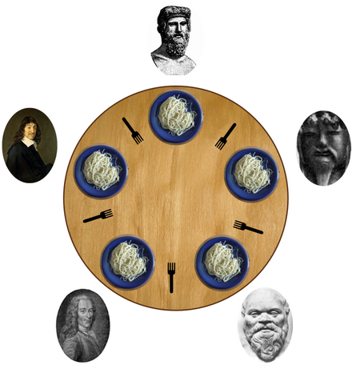
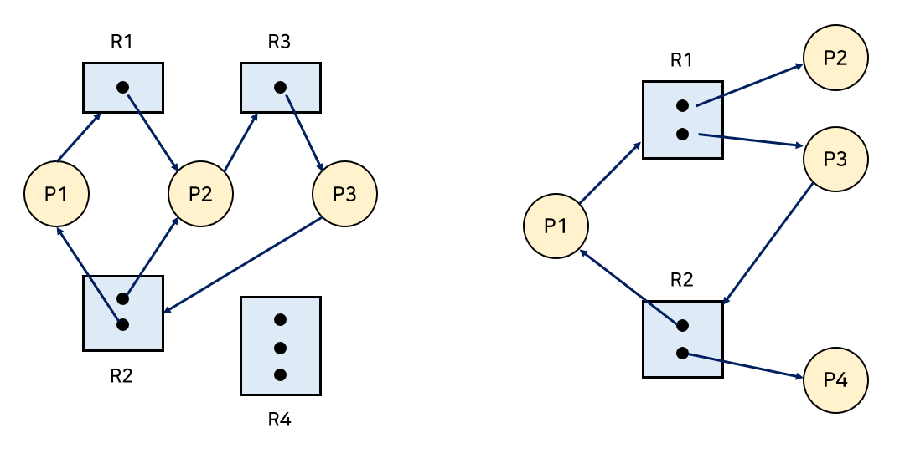
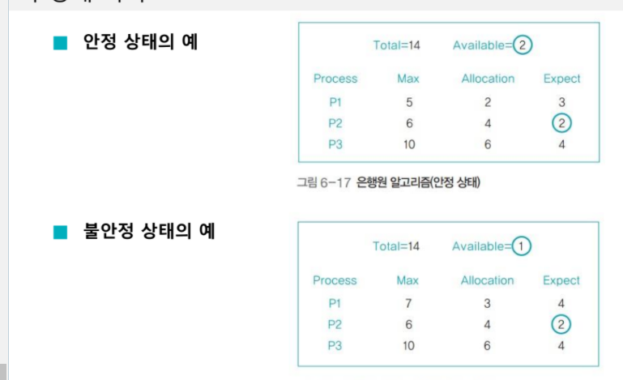

# DeadLock

Deadlkock은 프로세스가 필요한 자원을 얻지 못해 다음 처리를 하지 못하고 block된 상태이다. 교착상태를 설명하는 예로는 철학자들의 만찬 문제가 있다. 철학자 4명이 동그란 식탁에 둘러앉아 식사하는데, 왼쪽에 있는 포크를 잡은 뒤 오른쪽 포크를 잡아야만 식사가 가능하다는 조건이 있다. 철학자들은 음식을 먹기 위해 왼쪽의 포크를 잡은 뒤 오른쪽 포크를 잡으려고 옆을 볼 것이다. 그런데 옆에는 이미 다른 철학자가 왼쪽 포크를 잡고 있어서 오른쪽 포크를 잡을 수 없는 상황이 발생할 수 있다. 이런 상황이 반복되면 모든 철학자들이 포크를 잡지 못해 영원히 식사를 하지 못하는 상황이 발생한다. 이처럼 프로세스가 자원을 얻지 못해 다음 처리를 하지 못하고 무한정 기다리는 상태를 `Deadlock`이라고 한다.

## DeadLock 필요 조건
교착상태는 아래의 4가지 조건을 모두 충족해야 발생하고, 이 중 단 하나라도 충족하지 않으면 발생하지 않는다. 따라서, 이 네 가지 조건을 교착 상태 필요조건이라고 한다. 

1. Mutual Exclusion (상호 배제) -> 자원의 특징

    자원은 한번에 한 프로세스만 사용할 수 있어야 한다.

2. Hold and Wait (점유 대기) -> 프로세스의 행위

    자원을 가진 프로세스가 다른 자원을 기다릴때, 보유하고 있는 자원을 놓지 않고 계속 가지고 있는다.

3. No Preemption (비선점) -> 자원의 특징

    OS는 프로세스가 자원을 사용하는 동안 강제로 빼앗을 수 없다.

4. Circular Wait (순환 대기) -> 프로세스의 행위

    자원을 기다리는 프로세스 간에 사이클이 형성되어야 한다. 프로세스가 특정 자원에 대해 점유와 대기를 한다고 해서 모두 교착 상태에 빠지는 것은 아니다. 점유와 대기를 하는 프로세스들이 서로 방해하는 방향이 원을 이루면 프로세스들이 서로 양보하지 않기 때문에 교착상태에 빠진다.
    
    ex. 프로세스 1이 프로세스 2가 가진 자원을 기다리고, 프로세스 2가 프로세스 3이 가진 자원을 기다리고, 프로세스 3가 프로세스 1이 가진 자원을 기다리는 경우.

## Resouce allocation graph (자원 할당 그래프)

자원 할당 그래프는 프로세스가 어떤 자원을 사용 중이고, 어떤 자원을 기다리고 있는지를 방향성이 있는 그래프로 표현한 것이다. 자원 할당 그래프를 사용하면, Deadlock이 발생했는지 쉽게 판단할 수 있다.

이미지에서 P는 프로세스, R는 자원을 의미한다. 자원 내부의 동그라미는 자원 인스턴스의 개수이다. 인스턴스 개수가 여러개인 경우 이를 다중 자원이라고 한다. 자원에서 프로세스로 향하는 간선은 프로세스가 자원을 보유(allocate)하고 있다는 것을 의미하고, 반대로 프로세스에서 자원으로 향하는 간선은 프로세스가 자원을 요청(request)한 상태를 가리킨다.

만약 그래프에 사이클(Cycle)이 없다면 Deadlock이 아니다. 반면, 사이클이 있다면 Deadlock이 발생할 수 있다. 
정확히 말하면, 자원 당 하나의 인스턴스만 있는 경우엔 Deadlock이고, 여러 인스턴스가 존재하는 경우엔 Deadlock일 수도 있고 아닐 수도 있다. 
위의 그림에서는 왼쪽 그래프는 Deadlock이지만, 오른쪽 그래프는 Deadlock이 아니다. 
 

Deadlock문제를 해결하기 위한 방법으로는 대표적으로 미리 예방하는 방법(Prevention)과 Deadlock이 발생하지 않도록 피하는 방법(Avoidance), 그리고 발생했을 때 처리하는 방법(Detection and Recovery), 무시하는 방법(Ignorance) 총 네 방법으로 나뉜다. 
 

>`starvation` 
아사 현상은 정책상 잘못이나 오류로 인해 특정 프로세스의 작업이 이루어지지 않는 것을 말한다. 데드락과는 달리 아사 현상은 특정 프로세스가 무한정 기다리는 것이 아니라, 다른 프로세스에 밀려 작업이 늦어지는 것이다. 이는 에이징으로 해결할 수 있다. 교착상태는 아사 현상과 달리 오류 없이 자연적으로 발생한다. 따라서 교착 상태는 아사 현상보다 처리하기 복잡하기 때문에 이를 해결하기 위해 다양한 방법(예방, 회피, 검출, 회복 등)이 제시되었다.

## 예방

미리 예방하는 방식인 Deadlock Prevention은 자원을 할당할 때 Deadlock의 4가지 필요조건(상호배제, 점유대기, 비선점, 순환대기) 중 어느 하나가 만족되지 않도록 하는 방식이다. 

## 회피

자원 할당량을 조절하여 교착 상태를 해결하는 방식이다. 즉, 자원을 할당하다가 교착상태를 유발할 가능성이 있다고 판단되면 자원 할당을 중단하고 지켜보는 것이다. 그러나 자원을 얼마나 할당해야 교착상태가 발생하지 않는다는 보장이 없기 때문에 실효성이 적다.

- 은행원 알고리즘

교착상태 회피 구현방법은 여러가지인데, 그 중 하나는 은행원 알고리즘이다. 은행이 대출을 해주는 방식, 즉 대출 금액이 대출 가능한 범위 내이면(안정상태) 허용되지만 그렇지 않으면 거부되는 것과 유사하기 때문에 이렇게 불리게 되었다.

어떤 레스토랑에 우동 10인분과 스파게티 20인분을 만들 수 있는 분량의 재료가 준비되어있다고 가정하자. 은행원 알고리즘에서는 30명을 기준으로 예약을 받지 않고, 10명 이내로 예약을 받는다. 12명을 예약받았을때 12명이 모두 우동을 시킨다면 문제가 되기 때문이다. 물론 예약받은 12명 중 2명이 스파게티를 시킨다면 문제가 되지 않는다. 그러나 은행원 알고리즘은 최악의 경우를 기준으로 함으로써 문제 상황을 철저히 피해 교착 상태를 막는다.

    - 은행원 알고리즘 변수 및 개념
        - 전체 자원(Total): 시스템 내 전체 자원의 수
        - 가용 자원(Available): 시스템 내 현재 사용할 수 있는 자원의 수 (가용자원 = 전체 자원 - 모든 프로세스의 할당 자원)
        - 최대 자원(Max): 각 프로세스가 선언한 최대 자원의 수
        - 할당 자원(Allocation): 각 프로세스가 현재 할당받은 자원의 수
        - 기대 자원(Expect): 각 프로세스가 앞으로 사용할 자원의 수 (기대 자원 = 최대 자원 - 할당 자원)
        - 안정 상태: 각 프로세스의 기대 자원과 비교하여 가용 자원이 크거나 같은 경우가 한 번 이상인 경우를 말한다.

은행원 알고리즘에서 자원을 할당할 때의 기준은 다음과 같다.

    - 각 프로세스의 기대 자원보다 가용 자원이 크거나 같으면 자원을 할당한다. 가용 자원이 더 크다는 것은 그 자원을 사용해 작업을 끝낼 수 있는 프로세스가 있다는 의미이므로 안정 상태이다.
    - 가용 자원이 어떤 기대 자원보다 크지 않으면 할당하지 않는다. 가용 자원을 사용하여 작업을 마칠 수 있는 프로세스가 없다는 의미이므로 불안정 상태이다.

## 교착상태 검출과 회복

교착 상태 검출은 어떤 제약을 가하지 않고 자원 할당 그래프를 모니터링하면서 교착 상태가 발생하는지 살펴보는 방식이다. 만약 교착 상태가 발생하면 교착 상태 회복 단계가 진행된다. 교착 상태를 검출한 후 이를 회복시키는 것은 결론적으로 교착 상태를 해결하는 현실적인 방법이다.

교착 상태 검출은 타임아웃을 이용하는 방법과 자원 할당 그래프를 이용하는 방법이 있다. 

> `교착 상태 검출 방법` 
- 타임아웃 
    일정 시간 동안 작업이 진행되지 않은 프로세스를 교착상태가 발생한 것으로 간주하여 처리하는 방법이다. 교ㄱ 상태가 자주 발생하지 않을 것이라는 가정 하에 사용하는 것으로, 특별한 알고리즘이 없어 쉽게 구현할 수 있다. 타임아웃을 이용하는 방법을 '가벼운 교착 상태 검출'이라 부르고, 자원 할당 그래프를 이용하는 방법을 '무거운 교착 상태 검출'이라 부른다. 윈도우에서 '프로그램이 응답이 없어 종료합니다'라는 메시지가 바로 타임아웃을 이용하는 대표적인 예이다.

- 자원 할당 그래프 
    교착 상태를 검출하는 또 다른 방법은 자원 할당 그래프를 이용하는 것이다. 자원 할당 그래프를 이용해 교착 상태를 검출하는 방법은 프로세스의 작업 방식을 제한하지 않으면서 교착 상태를 정확하게 파악할 수 있다는 것이 장점이다. 그나 자원 할당 그래프를 유지, 갱신, 사이클을 검사하는 추가 작업으로 인해 오버헤드가 발생한다는 단점이 있다. 이러한 추가 작업을 줄이기 위해 자원이 할당될 때마다 사이클 검사를 하는 것이 아니라 일정 시간마다 하는 방법도 있다.

> `교착 상태 회복 방법` 
- 교착 상태를 유발한 프로세스를 강제 종료
    - 교착상태를 유발한 프로세스를 동시에 종료
    - 교착상태를 유발한 프로세스 중 하나를 골라서 순서대로 종료

## 무시

Deadlock이 일어나지 않는다고 생각하고 아무런 조치도 취하지 않는 방식이다. 그 이유는, Deadlock이 매우 드물게 발생하기 때문에 Deadlock에 대한 조치 자체가 더 큰 오버헤드일 수 있기 때문이다. 따라서 만약 시스템에 Deadlock이 발생한 경우, 시스템이 비정상적으로 작동하는 것을 사람이 느낀 후 직접 프로세스를 죽이는 등의 방법으로 대처한다. 이 방식은 UNIX, Windows 등 대부분의 범용 운영체제가 채택하는 방식이다. 

> reference

- <a href="https://rebro.kr/177">데드락(Deadlocks)</a>
- 도서 <쉽게 배우는 운영체제>