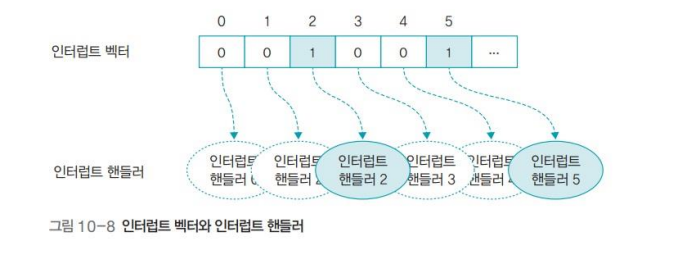

# 인터럽트

## 개념

인터럽트는 입출력 뿐만 아니라 시스템을 보호하는데 매우 중요한 작업이다. 입출력을 요청하고 입출력이 완료되면 이벤트를 발생시켜 이 사실을 알리게 되었는데 이를 인터럽트라고 한다. 인터럽트는 입출력 뿐만 아니라 매우 광범위하게 쓰인다. 예를 들면 유닉스 프로그램에서는 프로그램이 무한 루프를 돌고 있어서 멈추지 않을 때 Ctrl + C를 눌러 멈추는데, 이는 사용자가 만드는 인터럽트이다. 또하 어떠 ㄴ프로세스가 실행 도중에 다른 프로세스가 사용중인 메모리 영역을 침범하면 CPU에 있는 메모리 관련 레지스터가 인터럽트를 발생시켜 해당 프로세스를 강제 종료한다.

## 종류

인터럽트는 프로세스가 실행중인 명령어로 인해 발생하는 동기적 인터럽트와 실행중인 명령어와 무관하게 발생하는 비동기적 인터럽트로 나눌 수 있다. 동기적 인터럽트는 사용자 인터럽트라고도 하며 다음과 같은 종류가 있다.

- 프로그램 상의 문제 때문에 발생하는 인터럽트
- 컴퓨터 작업자가 의도적으로 프로세스를 중단하기 위해 발생시킨 인터럽트 (Ctrl + C)
- 입출력 장치 같은 주변 장치의 조작에 의한 인터럽트
- 산술 연산 중 발생하는 인터럽트 (ex. 어떤 수를 0으로 나눔)

비동기적 인터럽트는 하드디스크 읽기 오류, 메모리 불량과 같은 하드웨어적인 오류로 발생하는 인터럽트로 사용자가 직접 작동하는 키보드 인터럽트, 마우스 인터럽트 등이 있다.

## 인터럽트 처리 과정

운영체제에서 인터럽트가 처리되는 과정은 단순한다. 인터럽트에는 해당 인터럽트가 발생하면 어떤 일을 할지도 정의되어 있다. 즉 인터럽트 번호와 그 번호에 붙어있는 함수의 쌍으로 이루어져 있다. 예를 들어 윈도우 화면의 최소화 버튼에는 창을 작게 만드는 함수가 정의되어 있어 버튼을 누르면 창이 작아진다. 마찬가지로 최대화 버튼과 종료 버튼에도 함수가 정의되어 있어 버튼을 누르면 함수가 자동으로 실행된다.

시스템에는 많은 인터럽트가 존재하고 각각의 인터럽트에는 고유 번호, 즉 인터럽트 번호가 있다. 윈도우에서는 이 번호를 IRQ라고 하며, 시스템에 인터럽트가 발생하면 IRQ로 인터럽트를 식별한다. 인터럽트는 동시에 여러개가 발생하기도 하는데, 이러한 인터럽트를 하나로 묶어서 처리하는 개념이 인터럽트 백터이다.

인터럽트 백터는 인터럽트의 집합이다. 인터럽트가 발생하면 인터럽트 백터의 번호가 0에서 1로 바뀐다. 위 이미지에서는 2번이 1이 되었는데, 2번 인터럽트가 발생했다는 의미이다. 동시에 1이 되는 인터럽트 번호가 여러개일 수도 있다.

인터럽트 백터에는 각 인터럽트를 처리하는 함수가 연결되어 있다. 해당 인터럽트가 발생하면 어떤 일을 처리할 것인지가 이 함수에 정의되어 있는데 이를 인터럽트 핸들러라고 부른다. 모든 인터럽트에는 기본적인 인터럽트 핸들러가 정의되어 있으며 사용자가 이를 다시 정의할 수 있다.

다음은 자세한 인터럽트 처리 과정이다.

1. 인터럽트가 발생하면 현재 실행중인 프로세스는 일시 정지 상태가 되며, 재시작하기 위해 현재 프로페스 관련 정보를 임시로 저장한다.

2. 인터럽트 컨트롤러가 실행되어 인터럽트의 실행 순서를 결정한다. 이때 여러 개의 인터럽트가 동시에 발생한 경우, 인터럽트 우선순위를 고려해 중요한 인터럽트부터 처리하도록 순서를 결정한다.

3. 먼저 처리할 인터럽트가 결정되면 인터럽트 벡터에 등록된 인터럽트 핸들러가 실행된다. 인터럽트 핸들러는 인터럽트 처리를 위해 미리 정의된 함수이고, 인터럽트 백터는 인터럽트와 인터럽트 핸들러를 일대일로 연결한 자료구조이다. 인터럽트 처리를 위한 함수를 정의하여 인터럽트 벡터에 등록해놓으면 해당 인터럽트가 발생했을때, 함수가 실행된다.

4. 인터럽트 벡터에 연결된 핸들러가 인터럽트 처리를 마치면 일시 정지된 프로세스가 다시 실행되거나 종료된다. 발생한 인터럽트가 입출력 완료 같은 경우이면 일시 정지된 프로세스가 다시 실행되고, 다른 프로세스의 메모리 영역 침범이나 오류 같은 경우이면 종료된다.
