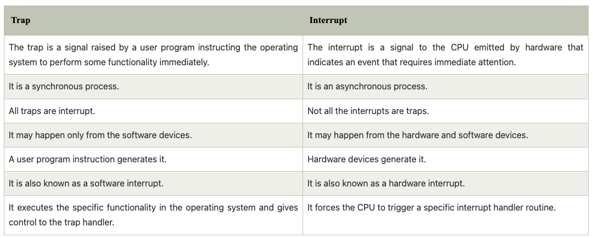

# 인터럽트

## 개념

인터럽트는 프로세스나 이벤트가 즉각적인 반응이 필요할때 하드웨어 또는 소프트웨어에 의해 보내지는 시그널이다. 하드웨어와 소프트웨어 모두에 의해 생성되기 때문에 주체에 따라 하드웨어 인터럽트, 소프트웨어 인터럽트로 구분되기도 한다. USB, 키보드 등에 의해 하드웨어 인터럽트가 발생할 수 있다. 키보드를 입력하면 인터럽트가 발생한다. CPU는 현재 실행 중인 프로세스를 정지하고 관련 정보를 임시로 저장하고, 인터럽트 핸들러를 호출할 것이다. 인터럽트 핸들러 실행이 끝나면 진행중었던 프로세스로 돌아온다. 인터럽트는 입출력 뿐만 아니라 매우 광범위하게 쓰인다. 예를 들면 유닉스 프로그램에서는 프로그램이 무한 루프를 돌고 있어서 멈추지 않을 때 Ctrl + C를 눌러 멈추는데, 이는 사용자가 만드는 인터럽트이다. 또한 어떤 프로세스가 실행 도중에 다른 프로세스가 사용중인 메모리 영역을 침범하면 CPU에 있는 메모리 관련 레지스터가 인터럽트를 발생시켜 해당 프로세스를 강제 종료한다.

트랩은 유저 프로그램에 의해 OS 기능을 즉시 사용하는 것이 필요할때, 발생하는 소프트웨어 인터럽트이다. 예를 들어, 유저 애플리케이션에서 스크린테 특정 데이터가 프린트되어야 한다면, 트랩을 발생시켜서 OS에서 데이터를 스크린에 표시하도록 할 수 있다. 이처럼 프로그램 코드 실행 중에 발생할 수도 있고, 0으로 나누는 등 산술 연산 중에 발생할 수도 있고, 다른 프로세스의 메모리 영역을 침범했을때 발생할 수도 있다. 프로그램이 OS에게 특정 서비스(기능)를 요청하고, OS에서 인터럽트를 발생시켜서 프로그램이 해당 기능을 사용할 수 있도록 하므로, 시스템 콜 또한 트랩의 한 종류이다.

## 인터럽트 처리 과정

운영체제에서 인터럽트가 처리되는 과정은 단순한다. 인터럽트에는 해당 인터럽트가 발생하면 어떤 일을 할지도 정의되어 있다. 즉 인터럽트 번호와 그 번호에 붙어있는 함수의 쌍으로 이루어져 있다. 예를 들어 윈도우 화면의 최소화 버튼에는 창을 작게 만드는 함수가 정의되어 있어 버튼을 누르면 창이 작아진다. 마찬가지로 최대화 버튼과 종료 버튼에도 함수가 정의되어 있어 버튼을 누르면 함수가 자동으로 실행된다.

시스템에는 많은 인터럽트가 존재하고 각각의 인터럽트에는 고유 번호, 즉 인터럽트 번호가 있다. 윈도우에서는 이 번호를 IRQ라고 하며, 시스템에 인터럽트가 발생하면 IRQ로 인터럽트를 식별한다. 인터럽트는 동시에 여러개가 발생하기도 하는데, 이러한 인터럽트를 하나로 묶어서 처리하는 개념이 인터럽트 백터이다.

인터럽트 백터는 인터럽트의 집합이다. 인터럽트가 발생하면 인터럽트 백터의 번호가 0에서 1로 바뀐다. 위 이미지에서는 2번이 1이 되었는데, 2번 인터럽트가 발생했다는 의미이다. 동시에 1이 되는 인터럽트 번호가 여러개일 수도 있다.

인터럽트 백터에는 각 인터럽트를 처리하는 함수가 연결되어 있다. 해당 인터럽트가 발생하면 어떤 일을 처리할 것인지가 이 함수에 정의되어 있는데 이를 인터럽트 핸들러라고 부른다. 모든 인터럽트에는 기본적인 인터럽트 핸들러가 정의되어 있으며 사용자가 이를 다시 정의할 수 있다.

다음은 자세한 인터럽트 처리 과정이다.

1. 인터럽트가 발생하면 현재 실행중인 프로세스는 일시 정지 상태가 되며, 재시작하기 위해 현재 프로페스 관련 정보를 임시로 저장한다.

2. 인터럽트 컨트롤러가 실행되어 인터럽트의 실행 순서를 결정한다. 이때 여러 개의 인터럽트가 동시에 발생한 경우, 인터럽트 우선순위를 고려해 중요한 인터럽트부터 처리하도록 순서를 결정한다.

3. 먼저 처리할 인터럽트가 결정되면 인터럽트 벡터에 등록된 인터럽트 핸들러가 실행된다. 인터럽트 핸들러는 인터럽트 처리를 위해 미리 정의된 함수이고, 인터럽트 백터는 인터럽트와 인터럽트 핸들러를 일대일로 연결한 자료구조이다. 인터럽트 처리를 위한 함수를 정의하여 인터럽트 벡터에 등록해놓으면 해당 인터럽트가 발생했을때, 함수가 실행된다.

4. 인터럽트 벡터에 연결된 핸들러가 인터럽트 처리를 마치면 일시 정지된 프로세스가 다시 실행되거나 종료된다. 발생한 인터럽트가 입출력 완료 같은 경우이면 일시 정지된 프로세스가 다시 실행되고, 다른 프로세스의 메모리 영역 침범이나 오류 같은 경우이면 종료된다.

> reference
 - <a href ="https://www.javatpoint.com/trap-vs-interrupt-in-operating-system">Difference between Trap and Interrupt in Operating System</a>