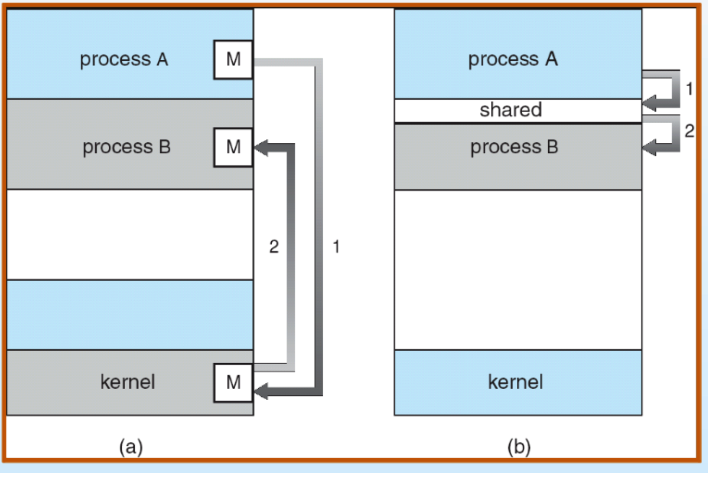

# Inter Process Communication

프로세스는 프로그램이 실행될 때 메모리에 적재되며 메모리 상에서 실행되는 작업의 단위이다. 우리가 사용하는 프로그램은 여러 개의 프로세스를 동시에 사용한다. 프로세스들은 서로 독립적인 자원과 데이터를 사용하지만, 상황에 따라 프로세스끼리 협력해야하기도(데이터 공유) 한다. 이때 프로세스 간 통신하는 과정을 IPC(Inter Process Communication)라고 한다. 

IPC 방식은 두 가지가 있는데, 하나는 Message Passing이고, 다른 하나는 Shared Memory 방식이다. 

## Message Passing

Message Passing 방식은 커널을 거쳐 메시지를 전달하는 방식이다. 이미 구현되어 있는 커널을 사용하기 때문에 구현이 비교적 쉽다는 장점이 있다. 하지만, 커널에 두 프로세스가 공유할 데이터가 저장될 공간이 필요하고, 속도도 비교적 느리다는 단점이 있다. 유저 모드와 커널 모드를 바꾸기 떄문에 시스템 콜이 호출되며 이로 인한 overhead도 발생하게 된다.

## Shared Memory

Shared Memory는 두 프로세스 간 공유 메모리 영역을 구축해 두 프로세스가 이 영역에서 데이터를 주고 받는다. 커널을 거치지 않기 때문에 속도가 빠르고 통신이 자유롭다. 하지만, producer-consumer 문제가 발생할 수 있다.

> producer-consumer problem

 producer는 정보를 생산하는 프로세스이고, consumer는 정보를 소비하는 프로세스이다. 이때, 발생할 수 있는 문제는, 공유 메모리에 아무것도 없는데 consumer가 소비하려고 시도해(consumer는 waiting해야함), consumer가 정상적으로 동작하지 못하는 경우와, 공유 메모리가 가득 차있는데, producer가 또 정보를 생산하려는 경우(producer는 waiting 해야함)이다. 

공유 메모리 속에 저장할 수 있는 데이터 영역이 한정되어 있는 bounded buffer일때 발생하는 문제로, 이때는 buffer의 상태를 지속적으로 확인해야한다.(Monitoring) 이 밖에도 semaphore나 mutex 등의 방식으로 강제 동기화하는 방법이 있을 수 있는데, 이 부분은 추후에 다룰 예정이다. 

> reference

- <a href="">[Process] Inter Process Communication (IPC)</a>