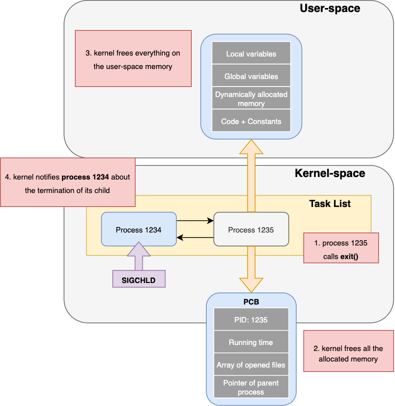

# PCB 

운영체제에서 여러개의 프로세스를 동시에 실행하기 위해서 사용하는 개념이 Process Control Block (PCB)이다. 
PCB의 구조와 프로세스 관리(Process Management)에서 PCB의 역할을 살펴보자.

## PCB 

> PCB는 운영체제가 프로세스를 효율적으로 관리할 수 있도록 한다. PCB는 작업 구조(task structure)라고도 불리며, 프로세스에 대한 정보(Process Metadata)를 제공한다. 다음은 메타데이터에 포함된 정보들이다.

- 프로세스 메타데이터
  - 포인터
    프로세스의 현재 위치를 저장하는 포인터 정보
  - 프로세스 상태
    프로세스의 각 상태 (생성(New), 준비(Ready), 실행(Running), 대기(Waiting), 종료(Terminated))를 저장
  - 프로세스 아이디
    모든 프로세스에는 프로세스 식별자인 PID라는 고유한 ID가 할당됨
  - 프로그램 카운터
    프로세스를 위해 실행될 다음 명령어 주소를 포함하는 카운터를 저장함
  - 레지스터
  - 메모리 제한
  - 열린 파일 목록

> 새로운 프로세스가 생성될때마다 고유한 PCB가 생성되고, 프로세스가 완료되면 PCB도 함께 제거된다.

리눅스 운영체제에서 메모리는 두 개의 메인 영역(유저 영역과 커널 영역)을 갖는다. 유저 프로세스들은 유저 메모리 영역에서만 실행되고, 커널 메모리 영역은 리눅스 커널 및 해당 데이터 구조(PCB 포함)가 저장된다. 새로운 프로세스가 생성되면, 커널 메모리 영역에 생성된 프로세스의 PCB를 할당한다. 앞서 설명한 프로세스 메타데이터의 정보 중 PID는 PCB의 인덱스로서 기능하며, 커널이 특정 PCB를 필요로 할때, PID로 PCB를 조회한다.

다음은 위의 이미지에 대한 설명이다. 프로세스가 종료됨에 따라 해당 프로세스의 PCB 또한 제거되는 것을 확인할 수 있다.

1. process 1235가 exit() 시스템 콜을 호출한다.
2. 커널은 커널 메모리 영역에 저장된 process 1235의 PCB를 제거한다. 
3. 커널은 유저 메모리 영역에서 process 1235를 제거한다.
4. 커널은 process 1234에게 child process의 종료를 알린다.

> reference
- <a href="https://www.baeldung.com/linux/pcb">The Process Control Block of a Process in Linux</a>