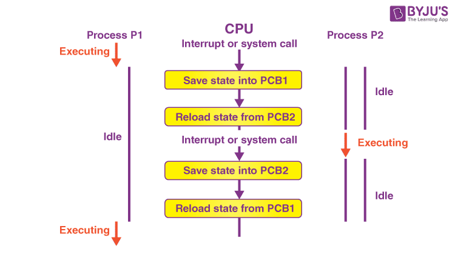

# PCB

운영체제에서 여러개의 프로세스를 동시에 실행하기 위해서 사용하는 개념이 Process Control Block (PCB)이다.
PCB의 구조와 프로세스 관리(Process Management)에서 PCB의 역할을 살펴보자.

> PCB는 운영체제가 프로세스를 효율적으로 관리할 수 있도록 한다. PCB는 작업 구조(task structure)라고도 불리며, 프로세스에 대한 정보(Process Metadata)를 제공한다. 다음은 메타데이터에 포함된 정보들이다.

- 프로세스 메타데이터
  - 포인터
    프로세스의 현재 위치를 저장하는 포인터 정보
  - 프로세스 상태
    프로세스의 각 상태 (생성(New), 준비(Ready), 실행(Running), 대기(Waiting), 종료(Terminated))를 저장
  - 프로세스 아이디
    모든 프로세스에는 프로세스 식별자인 PID라는 고유한 ID가 할당됨
  - 프로그램 카운터
    프로세스를 위해 실행될 다음 명령어 주소를 포함하는 카운터를 저장함
  - 레지스터
  - 메모리 제한
  - 열린 파일 목록

> 새로운 프로세스가 생성될때마다 고유한 PCB가 생성되고, 프로세스가 완료되면 PCB도 함께 제거된다.

리눅스 운영체제에서 메모리는 두 개의 메인 영역(유저 영역과 커널 영역)을 갖는다. 유저 프로세스들은 유저 메모리 영역에서만 실행되고, 커널 메모리 영역은 리눅스 커널 및 해당 데이터 구조(PCB 포함)가 저장된다. 새로운 프로세스가 생성되면, 커널 메모리 영역에 생성된 프로세스의 PCB를 할당한다. 앞서 설명한 프로세스 메타데이터의 정보 중 PID는 PCB의 인덱스로서 기능하며, 커널이 특정 PCB를 필요로 할때, PID로 PCB를 조회한다.

다음은 위의 이미지에 대한 설명이다. 프로세스가 종료됨에 따라 해당 프로세스의 PCB 또한 제거되는 것을 확인할 수 있다.

1. process 1235가 exit() 시스템 콜을 호출한다.
2. 커널은 커널 메모리 영역에 저장된 process 1235의 PCB를 제거한다.
3. 커널은 유저 메모리 영역에서 process 1235를 제거한다.
4. 커널은 process 1234에게 child process의 종료를 알린다.

# Context Switching

Context Switching은 CPU가 여러 작업을 실시간으로 동작하는 것처럼 (멀티 프로세싱) 빠르게 작업하기 위해 필요하다. CPU를 차지하던 프로세스가 나가고 새로운 프로세스를 받아들이는 작업이다. 이때 두 PCB의 내용이 변경된다. 실행 상태에서 나가는 PCB에는 지금까지의 작업 내용을 저장하고, 반대로 실행 상태로 들어오는 PCB의 내용으로 CPU가 다시 세팅된다.

> context switching 절차

위의 이미지는 p1과 p2의 context switching 과정을 보여준다. 실행 상태에 있는 프로세스 p1이 자신에게 주어진 시간을 다 사용하여 타임아웃이 되면 p1의 pcb에 현재까지의 모든 작업 결과가 저장되고 p1은 준비상태로 쫓겨난다. 준비 상태에 있던 프로세스 p2가 실행상태로 가면 CPU의 레지스터가 p2의 pcb로 채워져 다음 작업을 하게 된다.

> context switching overhead

context switching 때 CPU는 아무 일도 하지 못한다. 따라서 context switching이 잦아지면 오히려 오버헤드가 발생해 성능이 떨어진다.

> context switching이 일어나는 경우

일반적으로 한 프로세스가 자신에게 주어진 시간을 다 사용하면 발생하고, 인터럽트가 걸렸을 때도 발생한다. 예를 들어 어떤 프로세스가 자신에게 주어진 메모리 고간을 넘어가려 한다면 이는 경계 레지스터의 범위를 벗어나는 것이다. 이때 인터럽트가 발생하여 현재 실행중인 PCB를 저장한 후 인터럽트 관리 프로세스를 실행 상태로 만든다. 인터럽트 관리 프로세스는 메모리 범위를 넘어선 프로세스를 강제 종료하고 인터럽트 처리를 마치는데, 이와 같이 인터럽트 처리를 할 때도 context switching이 일어난다.

> reference

- <a href="https://www.baeldung.com/linux/pcb">The Process Control Block of a Process in Linux</a>
