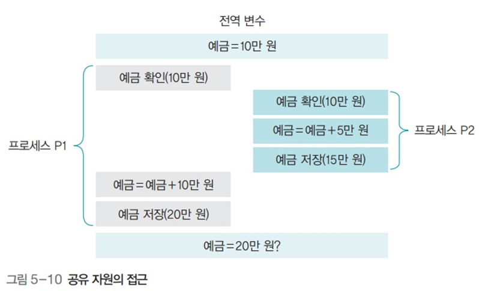
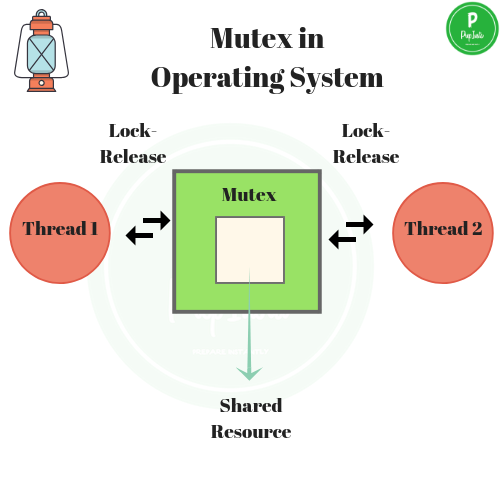
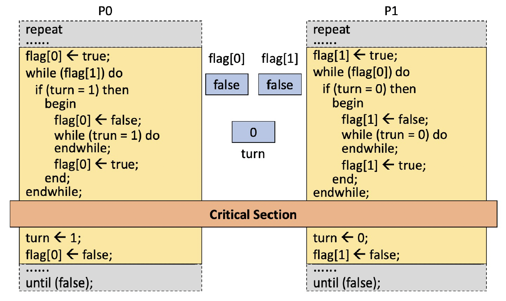
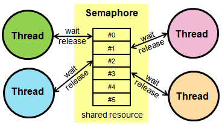

# 공유 자원과 임계구역

공유 자원이란, 여러 프로세스가 공동으로 이용하는 변수, 메모리, 파일 등을 말한다. 공유 자원은 누가 언제 데이터를 읽고 쓰느냐에 따라 그 결과가 달라질 수 있다. 만약 두 개 이상의 프로세스가 공유 자원을 병행적으로 읽거나 쓰는 상황을 '경쟁 조건(race condition)'이 발생했다고 한다. 경쟁 조건이 발생하면 공유 자원 접근 순서에 따라 실행 결과가 달라질 수 있다. 아래 이미지에서 결과적으로 예금이 25만원이 아니라 20만원이 남은 이유는 두 프로세스가 예금 10만원을 동시에 ㅇ릭고, 다른 프로세스의 작업을 무시하고 덮어썼기 때문이다.



공유 자원 접근 순서에 따라 실행 결과가 달라지는 프로그램의 영역을 임계구역(critical section)이라고 한다. 즉, 프로세스 실행 상황에서 동시에 공유할 수 없는 자원을 의미한다. 위의 예시에서처럼 두 프로세스가 공유할 수 없는 예금 확인 -> 입금 -> 예금 저장하는 부분이 임계구역이다. 실생활에서는 가스레인지는 화구가 여러개이므로 공유할 수 있는 공유 자원이지만, 믹서는 공유할 수 없다. 급하다고 수프에 쇠고기와 오렌지를 동시에 갈 수는 없기 때문이다. 믹서를 사용할 때에는 순서를 지켜야한다.

그러므로, 예금을 임계구역으로 지정해 P1이 먼저 실행되어 작업을 마친 후에 P2가 실행되도록 해야한다. 어떤 프로세스가 임계구역에 들어가면 다른 프로세스는 임계구역 밖에서 기다려야 하며 임계구역의 프로세스가 나와야 들어갈 수 있다.

# 프로세스 동기화

프로세스 동기화란, 병행(concurrent: operating or occurring at the same time) 프로세스들간 공유된 시스템 자원을 효율적으로 사용하는 것을 의미한다. 즉, 임계 구역을 동시에 사용하지 못하도록 하는 것이 프로세스 동기화라고 할 수 있다. 임계구역 문제를 해결하기 위해서는 다음 세 조건 상호 배제(Mutual Exclusion, Mutex), 한정 대기, 진행의 융통성이 조건을 모두 만족해야 한다.

# Mutex (Mutual Exclusion)

임계구역 문제를 해결하는 가장 단순한 방법은 잠금(lock)을 사용하는 것이다. 예를 들면 화장실에 사람이 들어가면 문을 잠그고, 다음 사람이 밖에서 기다린다. 화장실 문을 열고 나오면 다음 사람이 들어가도 좋다는 신호를 보내는 것이다. 문을 여는 동시에 동기화 신호를 보내는 것이다.



## 뮤텍스 알고리즘

- 피터슨 알고리즘 (Peterson algorithm)

  피터슨 알고리즘은 임계구역 문제를 해결하기 위해 게리 피터슨이 제안한 것이다. 아래에서 변수 turn은 두 프로세스가 동시에 lock을 설정해 임계구역에 못 들어가는 상황에 대비하기 위한 장치이다. 즉 두 프로세스가 동시에 lock을 설정했더라도 turn을 사용해 다른 프로세스에게 양보한다.

  피터슨 알고리즘은 임계구역 해결의 세 가지 조건을 모두 만족하지만 2개의 프로세스만 사용 가능하다는 한계가 있다. 여러 프로세스가 하나의 임계구역을 사용하려면 공유 변수를 추가하고 코드를 변경해야 한다.

  ```c
  // 공유 변수
  boolean lock1 = false;
  boolean lock2 = false;
  int turn = 1;

  // P1
  lock1 = true;
  turn = 2;

  while (lock2 == true && turn == 2) ;
  // 임계구역
  lock1 = false;

  // P2
  lock2 = true;
  turn = 1;
  while (lock1 == true && turn == 1) ;
  // 임계구역
  lock2 = false;
  ```

- 데커 알고리즘 (Dekker algorithm)

  테오도뤼스 데커가 제안한 데커 알고리즘도 임계구역 해결의 세 가지 조건을 모두 만족한다.

  ```c
  // 공유 변수
  boolean lock1 = false;
  boolean lock2 = false;
  int turn = 1;

  // P1
  lock1 = true;
  while (lock2 == true) {
    if (turn === 2) {
      lock1 = false;
      while (turn === 2) ;
      lock1 = true;
    }
  }
  // 임계구역
  turn = 2;
  lock1 = false;

  // P2
  lock2 = true;
  while (lock1 == true) {
    if (turn === 1) {
      lock2 = false;
      while (turn === 1) ;
      lock2 = true;
    }
  }
  // 임계구역
  turn = 1;
  lock2 = false;
  ```

  

피터슨과 데커 알고리즘은 임계구역 해결의 세 가지 조건을 모두 만적하지만 매우 복잡하다. 프로세스가 늘어나면 변수도 늘어나고 전체적인 알고리즘도 복잡해진다. 임계구역을 보호하기 위해 복잡한 알고리즘을 구현하는 것은 바람직한 접근 방법이 아니다.

# 세마포어 Semaphore

앞에서 살펴본 임계구역 해결 알고리즘은 바쁜 대기를 사용하여 자원을 낭비하고 알고리즘도 복잡하다. 이런 단점을 해결하기 위해 에츠허르 데이크스트라는 세마포어 알고리즘을 제안했다.



세마포어는 여러 프로세스들 간에 공유되는 정수 변수값을 사용한다. 변수가 0 또는 1로 고정된 Binary Semaphore와, 여러 프로세스가 공유 자원에 접근할 수 있는 최대 허용치로 설정할 수 있는 Counting Semaphore가 있다. 위의 이미지에서는 Counting Semaphore를 나타내고 있다.

Counting Semaphore에서 semaphore 값은 보통 최대 허용치는 공유 자원에 접근할 수 있는 동시 사용자(스레드, 프로세스)의 수이다. 프로세스가 공유 자원에 접근하면 세마포어는 1씩 감소한다. 세마포어 값이 0이 되면, 그 요청을 한 프로세스는 대기한다. 공유 자원을 다 사용한 프로세스가 있다면, 허용치가 1씩 증가한다.

세마포어는 wait, signal이라는 두 가지 연산을 통해 구현된다.

## Wait Operation

Wait operation은 세마포어 값을 감소시키는 연산이다. 만약 세마포어 값이 0보다 크면 세마포어 값을 감소시키고, 0보다 작거나 같으면 프로세스는 블록된다.

```c
// Semaphore Wait Operation
Function wait(S) is
  if S > 0 then
      // do not block the process
      S ← S - 1;
      return;
  else
      // Block the calling process
    sleep;
  end
end
```

## Signal Operation

Signal operation은 세마포어 값을 증가시키는 연산이다. 만약 대기 중인 프로세스가 있다면, 그 중 하나를 깨운다. 만약 대기 중인 프로세스가 없다면, 세마포어 값을 증가시킨다.

```c
// Semaphore Signal Operation
Function signal(S) is
  if there are processes sleeping on S then
    select a process to wake up;
    wake up the selected process;
    return;
  else
    // no process is waiting
    S ← S + 1;
    return;
  end
end
```

Binary Semaphore에서는 S의 초기값이 1로 설정된다.

```c
procedure P(S)
    while S=0 do wait
    S := S-1   // S를 0로 만들어 다른 프로세스가 들어 오지 못하도록 함
end P

procedure V(S)  // 현재상태는 S가 0임
    S := S+1   // S를 1로 변경
end V
```

> reference

- <a href="https://www.baeldung.com/cs/semaphore">What Is a Semaphore?</a>

- <a href="https://www.baeldung.com/cs/what-is-mutex">What Is A Mutex?</a>

- <a href="https://incheol-jung.gitbook.io/docs/q-and-a/computer-science/undefined-1">뮤텍스와 세마포어</a>

- <a href="https://www.techtarget.com/searchnetworking/definition/mutex">mutual exclusion (mutex)</>
