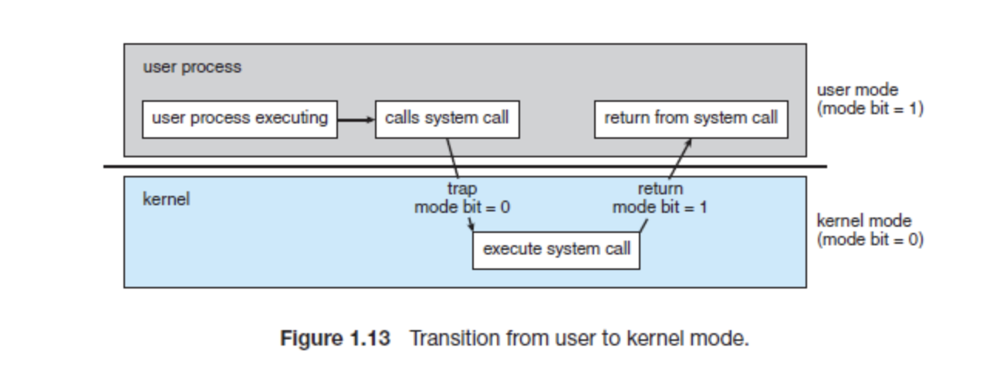
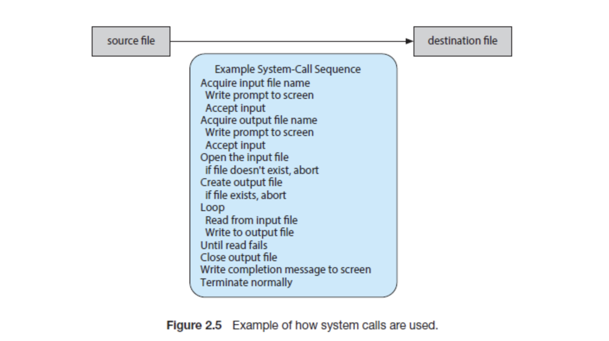

# System Call

시스템 호출은 운영 체제의 커널이 제공하는 서비스에 대해 응용 프로그램의 요청에 따라 커널에 접근하기 위한 인터페이스이다.

시스템 콜에는 각 번호가 할당되고, 각 시스템 콜은 시스템 콜 핸들러 함수 주소로 구성되는 시스템 콜 테이블이 있다. 운영체제는 주소에 저장되어 있는 기능을 수행한다. 작업이 완료되면 CPU에게 인터럽트를 발생시켜 수행이 완료되었음을 알린다.

## 사용하는 이유



운영체제 내부에서는 컴퓨터가 CPU를 어떻게 사용하느냐에 따라 두 가지 방식으로 컴퓨터를 제어한다. 유저모드는 CPU의 명령어를 마음대로 설정할 수 없다. 커널모드에서는 CPU를 직접 컨트롤 할 수 있다. 프로세스는 실행되는 과정에서 수없이 유저모드와 커널모드를 왔다갔다 한다. 두 모드 간의 스위칭은 시스템 콜을 통해 이루어진다. 현재 운영체제가 유저모드를 사용하고 있을때, 사용자 입력에 의해 시스템 콜이 호출이 되면 커널모드로 바뀐다. 사용자 요청에 맞는 작업을 하고 다시 유저모드로 돌아온다. 평소에는 유저모드로 대기하고 있다. 

운영체제에서 두 가지 모드로 구분하는 이유는 자원을 보호하기 위함이다. 누구나 쉽게 CPU 자원에 접근하고 조작할 수 있다면 시스템 전체를 망가뜨릴 수도 있을 것이다. 따라서 이러한 명령어들은 특별하게 커널 모드에서만 실행할 수 있도록 설계되었고, 만약 유저 모드에서 시스템 콜을 호출할 경우에는 운영체제에서 불법적인 접근이라 여기고 인터럽트를 발생시킨다.

- 유저모드
  - 유저 어플리케이션 코드 실행

- 커널모드
  - 모든 자원(드라이버, 메모리, CPU 등)에 접근, 명령 가능


## 예시 

```java
cp in.txt out.txt // in.txt 내용을 복사해서 out.txt 파일을 만들어라
```
위의 명령어를 실행했을때, 동작하는 시스템 콜을 살펴보자.




> reference
- <a href="https://coduking.com/entry/%EC%9A%B4%EC%98%81%EC%B2%B4%EC%A0%9C-%EC%9C%A0%EC%A0%80%EB%AA%A8%EB%93%9C-%EC%BB%A4%EB%84%90%EB%AA%A8%EB%93%9C-%EC%8B%9C%EC%8A%A4%ED%85%9C%EC%BD%9C">운영체제: 유저모드, 커널모드, 시스템콜</a>