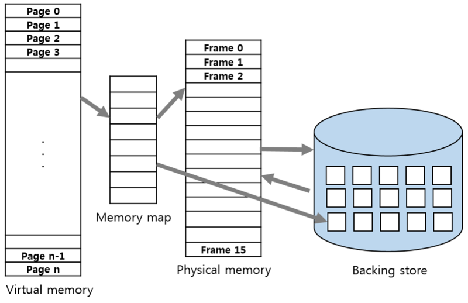

# CPU의 연산 동작 과정

CPU는 연산을 수행하기 위해 레지스터를 사용한다. 레지스터는 CPU 내부에 있는 메모리로, CPU가 연산을 수행할 때 필요한 데이터를 임시로 저장하는 공간이다. 레지스터는 CPU 내부에 있기 때문에 CPU가 레지스터에 접근하는 속도는 매우 빠르다. 그러나 레지스터의 크기는 작기 때문에 한정된 데이터만 저장할 수 있다. 따라서 CPU는 레지스터에 저장할 데이터가 많아지면 레지스터에 저장할 수 없는 데이터는 메모리에 저장한다. CPU가 실행하는 프로그램의 코드와 데이터는 `메모리`에 저장되어 있어야 한다. 더 많은 데이터를 저장하기 위해서는 외부 저장장치 `disk`를 사용한다. disk는 용량이 크고 비휘발성이지만, CPU가 접근하기 위해서는 OS의 IO 작업이 필요해 비교적 느리다.  

disk에 프로그램은 이진 실행파일 형태로 적재된다. 이 프로그램이 실행되려면(CPU가 실행하려면), 실행파일이 메모리에 프로세스의 형태로 적재되어야 한다. 

> ### 메모리, 물리 주소, 논리 주소 
    >메모리의 최대 크기는 CPU의 비트에 따라 결정된다. 32 bit CPU의 경우, 32bit로 표현할 수 있는 최대값인 2^32 - 1 (4GB)만큼의 메모리를 최대로 사용할 수 있다. 즉, 32bit CPU에는 2^32 만큼의 데이터를 저장할 수 있는 칸이 있는 셈이다.
    >물리 주소는, 메모리를 하나의 배열이라고 할때, 배열의 인덱스를 의미한다. 논리 주소는, CPU 입장에서의 메모리 주소이다. 모든 프로세스는 메모리 시작 주소와 크기를 나타내는 레지스터가 정의되어 있는데, 각각 `Base Register`와 `Limit Register`라고 한다. 이제 모든 프로세는 Base Register로부터 물리적 주소에서의 시작 주소를 알 수 있기 때문에 항상 0번지 주소부터 시작해도 된다. 따라서 새로운 프로세스가 생성되면 항상 0번지 주소부터 시작한다. 

다시 이어서, CPU는 논리 주소를 이용해 메모리에 접근하고, 이 논리 주소는 어떤 방법으로든 물리 주소로 맵핑되어야 하고, 이것을 진행하는 것이 `MMU`이다. MMU는 CPU가 메모리에 접근하는 것을 관리하는 하드웨어 부품이다. MMU는 Base Register에 저장된 프로세스의 메모리 물리 주소와 CPU가 전달한 논리 주소를 더해 물리 주소로 변환한다. 이렇게 변환된 물리 주소를 이용해 메모리에 접근한다. 

## 메모리가 가득 차면?

메모리에 여러개의 프로세스가 적재되어 있어, 더 이상 적재할 공간이 없다면 어떻게 해야할까? 이때 사용되는 것이 스왑영역이다. 스왑영역은 disk에 존재하지만 메모리의 확장 개념으로 휘발성이 있고, 상대적으로 빠르다.  

즉, 메모리가 가득 찼을때, 일부 프로세스를 스왑 영역으로 보내고 (스왑아웃) 몇 개의 프로세스 작업을 마치면 스왑영역에 있는 프로세스를 메모리로 가져온다.(스왑인) 물론 이때마다 IO 작업이 필요하게 된다.

# 가상 메모리 

위의 설명처럼 스왑 영역을 사용해 프로세스를 메모리에 올리고 내리는 과정을 반복하더라도, 메모리에 올라간 프로세스가 많을 수록 나누어 사용할 수 있는 메모리가 작아지고, 메모리보다 큰 프로세스는 실행조차 할 수 없게 된다. 

이를 해결하기 위해 `가상 메모리`가 등장했다. 가상 메모리는 물리 메모리의 크기와 상관없이 메모리를 이용할 수 있도록 하는 기술이다. 프로그래머는 가상 메모리 덕분에 물리 메모리 크기에 구애받지 않고 작업할 수 있다.

가상 메모리의 핵심은 필요한 부분만 메모리에 올려 실행하자는 것이다. 이를 구현한 방법으로는 `페이징`과 `세그멘테이션`이 있다.

## 요구 페이징 기법 (Demand Paging)

요구 페이징 기법은 가상 메모리를 동일한 크기의 공간으로 나누고, 그 공간를 페이지라고 부른다. 물리 메모리의 각 영역은 페이지와 구분하기 위해 프레임이라고 부르며, 페이지와 프레임은 같은 크기를 갖는다. 모든 페이지의 위치 정보, 즉 어떤 페이지가 어떤 프레임에 있는지에 대한 매핑 정보는 테이블에 담겨 있다. 프로세스가 실행되는 동안 <b>필요한 페이지만 메모리에</b> 올리고, <b>필요하지 않은 페이지는 디스크에 저장</b>해 메모리를 절약할 수 있다.

- 페이지 테이블 

    

    페이지 테이블은 하나의 열로 구성된다. 모든 페이지의 정보를 순서대로 가지고 있기 때문에 위에서부터 차례로 페이지0, 페이지1, 페이지2, ... 와 같은 프레임 번호를 가지고 있어 추가 열이 필요 없다. 위의 이미지에서는 페이지 0은 프레임1에, 페이지 1은 프레임4에 위치한다. 그런데, 페잊이 테이블에는 숫자만 있는 것이 아니라, invalid라는 것이 있다. 이는 해당 페이지가 스왑 영역에 있다는 의미이다.

    페이지 테이블은 프로세스마다 하나씩 존재하며, 메모리에 저장된다. 페이지 테이블 Base register, 페이지 테이블 Length Regsiter가 각각 페이지 테이블과 페이지 테이블의 사이즈를 가리키고 있고, 이러한 레지스터의 내용은 PCB(Process Control Block)에 저장되어 있고, context switching이 일어날 때 교체된다. 페이지 테이블이 메모리에 위치해있기 때문에 모든 접근은 두 번의 메모리 접근이 필요하여 오버헤드가 있다. (한 번은 페이지 테이블, 한 번은 실제 메모리에 접근)

- 페이지 폴트 (Page Fault)

    CPU가 프로그램을 실행하면서 필요한 페이지가 메모리에 없는 경우도 있을 수 있는데, 이것을 페이지 폴트라고 한다. 이 경우, 보통은 스왑 영역에서 페이지를 찾아 물리 메모리에 로드한다.

    페이지 테이블에 invalid가 저장되어 있다면, MMU는 trap을 발생시켜서 운영체제에 알리고, 운영체제는 CPU 동작을 잠시 멈춘다. 운영체제는 요구된 페이지를 스왑 영역에서 찾아 메모리에 로드하고, 페이지 테이블을 최신화한다. 그리고 CPU가 다시 작업을 실행한다. 

- 내부 단편화

    

    메모리를 할당할때 프로세스가 필요한 양보다 더 큰 메모리가 할당되어서 프로세스에서 사용하는 메모리 공간이 낭비되는 것을 내부 단편화라고 한다. 

## 세그멘테이션 (Segmentation)

세그멘테이션은 메모리를 프로세스의 크기에 따라 가변적으로 나누어 사용한다. 세그멘테이션 기법도 페이징 기법과 마찬가지로 세그멘테이션 테이블을 사용한다. 

- 세그멘테이션 테이블

    세그멘테이션 테이블에는 세그먼트의 크기를 나타내는 limit과 물리 메모리 상의 시작 주소를 나타내는 address가 있다. 페이징 기법에서는 메모리를 같은 크기의 페이지 단위로 분할하기 때문에 매핑 테이블에 크기 정보를 유지할 필요가 없다. 하지만 세그멘테이션 기법에서는 프로세스의 크기에 따라 메모리를 분할하기 때문에 매핑 테이블에 크기 정보를 포함한다. 각 세그먼트가 자신에게 주어진 메모리 영역을 넘어가면 안되기 때문에 세그먼트의 크기 정보에는 크기를 뜻하는 size 대신 limit이라는 이름을 사용한다.

    세그먼테이션 기법에서도 물리 메모리가 부족할 때 스왑 영역을 사용한다. 세그먼테이션 기법은 가변 분할 방식을 기본으로 하므로 가변 분할 방식의 장점과 단점을 모두 가지고 있다. 장점으로는 메모리를 프로세스 단위로 관리하기 때문에 페이지 테이블이 작고 단순하다는 것을 꼽을 수 있고, 단점은 메모리의 외부 단편화로 메모리 관리가 복잡하다는 것이다. 

- 외부 단편화

    

    메모리가 할당되고 해제되는 작업이 반복적으로 일어날때, 할당된 메모리와 메모리 사이에 중간중간 사용하지 않는 작은 메모리가 생긴다. 작은 메모리들의 합인 총 메모리 공간은 충분하지만 실제 할당 가능한 공간은 부족하여 할당할 수 없는 상황을 외부 단편화라고 한다. 

> reference

- <a href="https://www.youtube.com/watch?v=5pEDL6c--_k">[10분 테코톡] 🧚🏻 배럴의 가상 메모리</a>
- <a href="https://charles098.tistory.com/103">charles098.tistory.com</a>
- <a href="https://velog.io/@tlsdnxkr/CS-%EB%8B%A8%ED%8E%B8%ED%99%94-%EC%84%B8%EA%B7%B8%EB%A9%98%ED%85%8C%EC%9D%B4%EC%85%98-%ED%8E%98%EC%9D%B4%EC%A7%95%EB%82%B4%EB%B6%80%EB%8B%A8%ED%8E%B8%ED%99%94-%EC%99%B8%EB%B6%80%EB%8B%A8%ED%8E%B8%ED%99%94">단편화, 세그멘테이션, 페이징(내부단편화 ,외부단편화)</a>
- 도서 [쉽게 배오는 운영체제] (조성호 저)