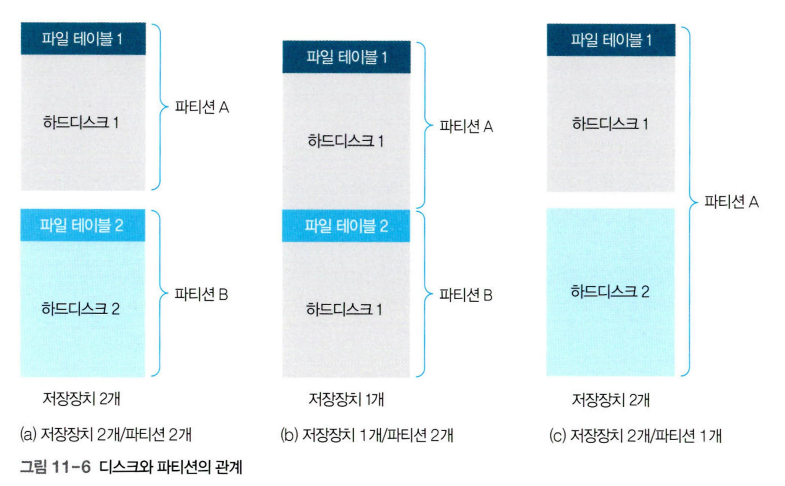
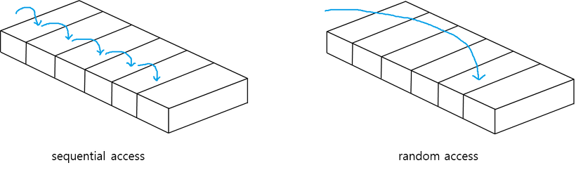
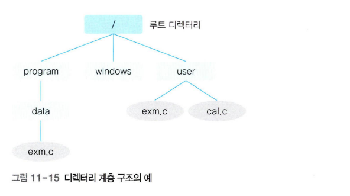

# 파일과 파일 시스템

파일은 논리적인 저장 단위로, 관련된 정보 자료의 집합에 이름을 붙인 것이다. 일반적으로 레코드 혹은 블록 단위로 비휘발성 보조기억장치에 저장된다. 파일은 메타데이터와 데이터로 구성되는데, 메타데이터는 파일이름, 유형, 저장위치, 사이즈, 접근 권한, 소유자, 시간 등에 대한 정보를 말한다. 데이터는 파일에 저장된 정보 자료를 말한다.

파일 시스템은 파일과 파일의 집합체인 디렉터리(directory)를 관리한다. 유닉스는 디렉토리라고 하고, 윈도우는 폴더라고 한다. 

파티션은 연속된 저장 공간을 하나 이상의 연속되고 독립적인 영역으로 나누어 사용할 수 있도록 정의한 규약이다. 하나의 물리적 디스크 안에 여러 파티션을 두는 게 일반적이지만, 여러 물리 디스크를 파티션으로 구성하기도 한다.
    

### 기능

- 파일 및 디렉토리의 CRUD (Create, Read, Update, Delete) 기능을 제공
- 파일 및 디렉터리에 대한 접근 방법을 제공하고 권한이 없는 사용자의 접근을 차단
- 파일 내용이 손상되지 않도록 무결성을 보장
- 파일을 암호화하여 악의적인 접근으로 부터 차단

### 접근 방법

1. 순차 접근 (Sequential Access)

- 가장 간단한 접근 방법으로, 카세트테이프를 사용하는 방식과 동일하다.
- 원하는 레코드를 찾기 위해 파일의 현재 위치에서 차례로 탐색한다. 
- 레코드를 접근할때마다 디스크를 물리적으로 움직여야 하므로 비효율적이다.
    - 순차접근의 비효율성을 줄이기 위해 레코드 블록화 기법을 사용한다. 블록은 여러 레코드의 집합이며, 파일 시스템은 레코드를 하나씩 읽어 메모리에 적재하는 것이 아니라 디스크에서 블록 단위로 데이터를 읽어 메모리에 적재한다. 
        ex. 4000개의 레코드로 구성된 파일을 크기가 16인 블록으로 나누면 250개의 블록으로 구성된다. 이때 250개의 블록을 읽어오는 것이 4000개의 레코드를 하나씩 읽어오는 것보다 효율적이다. (단, 블록의 크기가 너무 크면 필요없는 데이터까지 읽어오게 되어 효율성이 떨어진다.)

2. 직접 접근 (Direct Access)

- 파일의 레코드를 임의의 순서로 접근할 수 있다. LP판을 사용하는 방식과 동일하다. 
- 시스템이나 프로그래머가 원하는 위치부터 파일을 읽을 수 있다. 5번 레코드에 접근하기 위해 1,2,3,4를 순차적으로 접근하는 것이 아니라 5번 레코드에 바로 접근한다. 
- 직접 접근 방식은 레코드의 시작 주소를 알아야한다. 이를 해결하기 위해 상대적 레코드 번호 (Relative Record Number, RNN)을 이용한다. RNN은 디스크상에서 레코드의 절대적 위치를 나타내는 것이 아니라, 레코드가 속한 파일의 시작으로부터 레코드의 위치를 나타내는 것이다. 고정 길이 레코드 방식이라면, RNN을 이용해 레코드의 위치를 계산할 수 있다. 그러나 가변 길이 레코드 방식이라면, RNN을 이용해 레코드의 위치를 계산할 수 없고, 각각의 레코드의 상대적 시작 주소를 별도로 저장해야한다. (Index Access)
- 읽기나 쓰기의 순서에 제약이 없고, 현재 위치를 유지할 수 있다면 이를 통해 순차 접근 기능도 구현할 수 있다.

## 디렉토리 구조 

디렉토리는 1개 이상의 자식 디렉토리와 1개 이상의 파일을 가질 수 있다. 루트 디렉토리는 최상위에 있는 디렉토리로 `/`로 표시한다. `.`는 현재 디렉토리를, `..`는 상위 디렉토리를 나타낸다. 

> reference
- <a href="https://yoondii.tistory.com/30">파일접근 방식인 순차접근과 임의접근에 대해 설명해주세요.</a>
