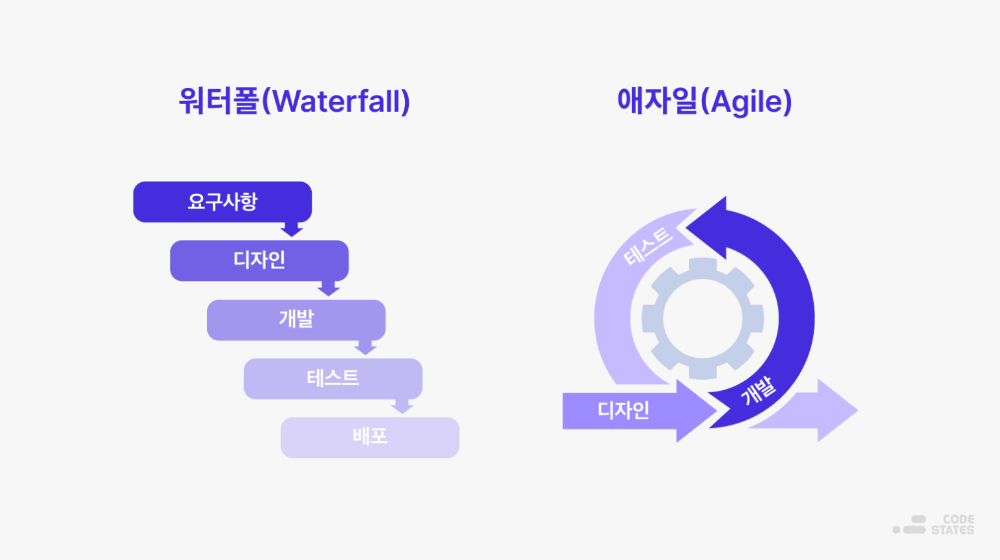
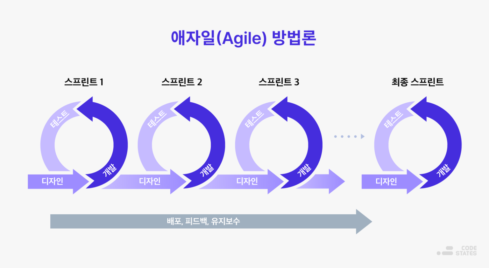
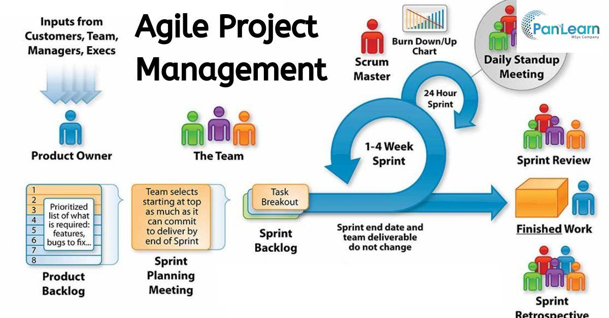
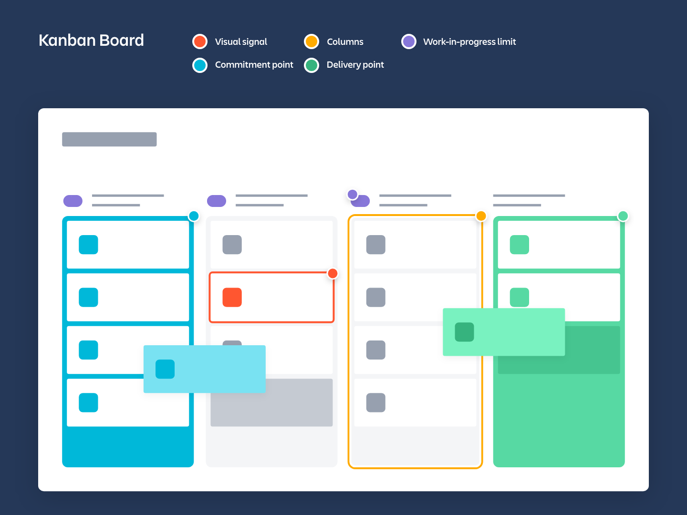

# Agile

### 애자일의 기원

애자일 작업 방식은 Henry Ford의 1913년 생산 라인 제조 방법에서 파생되어 나중에 소프트웨어 개발에 적용된 워터폴 방법의 한계를 극복하기 위해 고안되었다. 

워터폴 방법론은 소프트웨어 개발 계획을 정해두고 각 단계별로 진행하는 방법으로 계획에 의존하고 형식적인 절차를 따른다는 특징이 있다. 요구사항 정의(설계) => 디자인 => 개발 => 테스트 => 배포 까지의 과정이 순차적으로 진행되며 이전 단계가 다음 단계로 떨어지게 된다. 

애자일은 많은 소프트웨어 개발자가 워터폴의 프로덕션 주기와 협업 방법이 원하는 결과를 내지 못한다는 점에 주목하면서 만들어졌다. 이 문제는 조직의 비즈니스 요구 사항 검증에서 작동가능한 애플리케이션 제공까지 지체되는 일이 일반적이었던 1990년대 초까지 만연했다. 지체되는 과정에서 프로젝트 상당 부분이 구현되기도 전에 취소되기도 했는데, 이 처럼 시간과 자원이 낭비되자 소프트웨어 개발자가 대안을 모색하기 시작했다.

Agile은 '기민한', '민첩한'이라는 뜻으로 일정한 주기를 가지고 빠르게 제품을 출시하여 고객의 요구사항, 변화된 환경에 맞게 요구사항을 수용하고 적응하는 방법론이다.

2001년 경험 많은 소프트웨어 개발자들은 본인이 기존의 워터폴 방법론이 아닌 새로운 프로세스로 개발하고 있다는 사실을 인식했고 애자일 선언문 (Manifesto for Agile Software Development)을 발표햔다. 

### 애자일 소프트웨어 개발 선언

> 우리는 소프트웨어를 개발하고, 또 다른 사람의 개발을 도와주면서 소프트웨어 개발의 더 나은 방법들을 찾아가고 있다. 이 작업을 통해 우리는 다음을 가치있게 여기게 되었다.

- 공정과 도구보다 개인과 상호작용을
- 포괄적인 문서보다 작동하는 소프트웨어를
- 계약 협상보다 고객과의 협력을
- 계획을 따르기보다 변화에 대응하기를

가치있게 여긴다. 

이 말은 오른쪽에 있는 것들에 더 높은 가치를 둔다는 것이다.

### 애자일 방법론 프로세스

많은 기업에서 스크럼과 같은 애자일 프로세스를 주로 활용한다. 짧은 사이클로 제품을 개발하고 테스트하고 피드백을 받아 보완하는 방식이다. 변화에 수동적으로 대처하기보다 변화를 하나의 고정값으로 전제하여 1~4주 작은 스프린트 단위로 디자인 -> 개발 -> 테스트를 진행한다.

### 애자일 프레임워크

애자일 프레임워크란, 애자일 방법론을 따르는 개발 기법으로 스크럼, 칸반, XP(eXtreme Programming) 등이 있다.

- 스크럼

    

    스크럼은 5~9명으로 구성되는 소규모의 팀이 제품을 개발하기 위해 스프린트를 반복한다. 팀의 구성원 중에 PO (제품 책임자)는 제품 백로그 (해야할 일 목록)를 정리하고 스프린트에 진행할 백로그를 결정한다. 스크럼 마스터는 팀이 성과를 낼 수 있도록 조력하는 역할로, 팀이 과제를 완수할 수 있도록 필요한 자원을 지원하거나 장애 요소를 제거해 프로세스를 인도하는 역할을 한다.

    - PO가 개발할 기능 우선순위를 정리하고, 팀원들이 함께 정리된 백로그에서 스프린트 기간 내에 개발할 기능을 선택한다. 
    - 개발 주기는 1~4주 정도로 짧게 설정하고, 실제 동작할 수 있는 결과물을 만들어낸다.
    - 매일 15분 정도의 데일리 스크럼 미팅을 진행하면서 어제 진행한 업무, 오늘 진행할 업무, 어려운 점 등을 공유한다.
    - 스크럼 마스터는 데일리 스크럼 미팅을 토대로 Burn Down Chart를 작성하여 프로젝트 진행 상황을 파악한다. 목표 진행 상황과 비교함으로써 프로젝트 기간을 연장할 것인지, 추가 리소스를 투입할 것인지 마무리할 것인지를 결정할 자료를 만든다.
    - 스프린트 종료 후에는 Iteration Review와 Retrospective를 진행한다. Iteration Review를 통해 고객이 함꼐 있는 상황에서 결과물에 대한 피드백과 평가를 받는다. Retrospective를 통해 고객이 없는 상황에서 스프린트 동안의 문제점과 개선점을 찾아내고, 다음 스프린트에 반영한다. 

- 칸반

    

    칸반은 연속적 흐름 처리 방식이다. 이슈는 큐에 입력되고 개발 프로세스의 단계에 따라 당겨진다. 칸반은 칸반보드로 시각화되고 가각 단계는 열로 표시한다. (WIP 제한 & 멀티 테스킹 지양)

    - 이슈는 행으로 나누고 우선순위가 낮은 이슈들은 아래에 배치한다.
    - 칸반의 핵심은 WIP가 동시에 개발 진행될 수 있는 이슈의 수를 제한하는 것이다. 작업자는 WIP에 여유가 있을떄만 작업을 왼쪽에서 오른쪽으로 당길 수 있다.
    - 스크럼은 스프린트에 이용할 수 있는 시간을 제한함으로써 생산성을 제어하는 반면, 칸반은 동시에 처리할 수 있는 이슈의 수를 제한함으로써 생산성과 속도를 제어한다.

