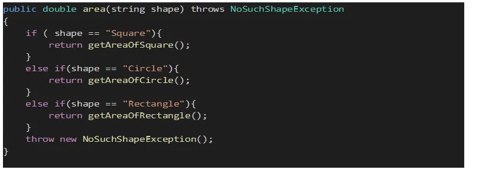
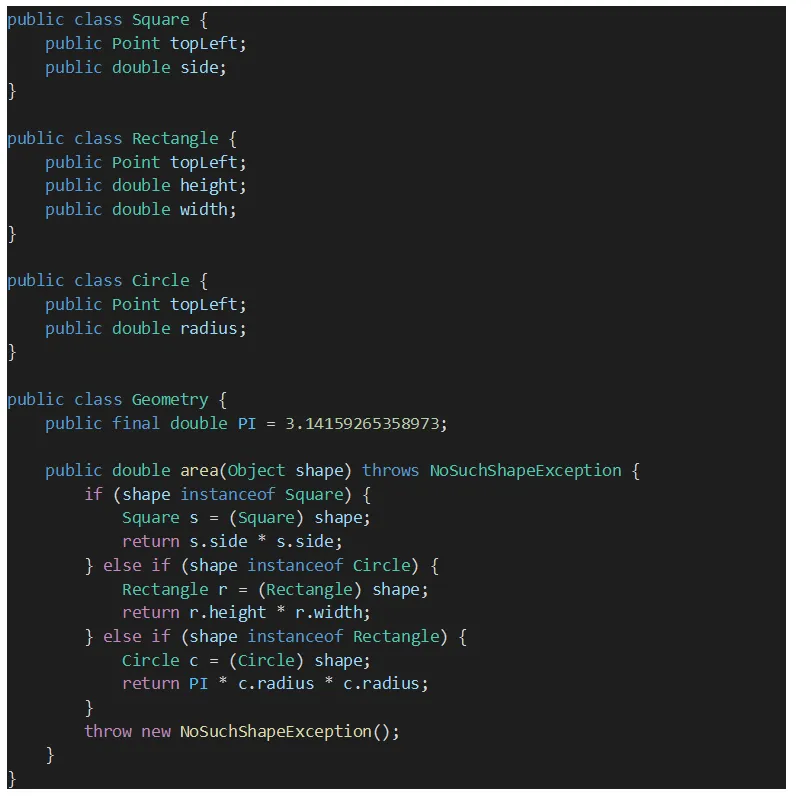
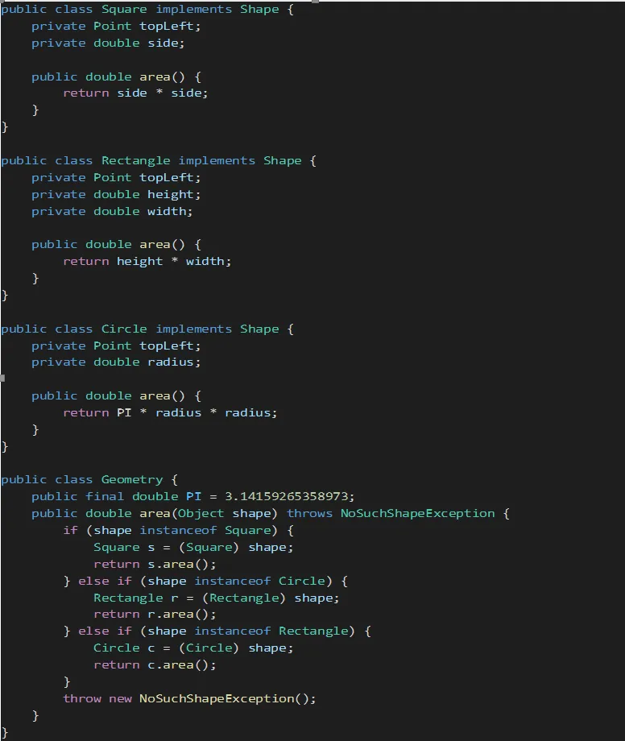

# 프로그래밍 패러다임 

패러다임이란, 한 시대의 사람들의 견해나 사고를 규정하는 인식 체계 또는 사물에 대한 이론적인 틀이나 체계를 말한다. 즉, 일종의 틀을 가리킨다. 따라서 프로그램이 패러다임이란, 프로그래밍 방식에 대한 인식 체계 또는 이론적인 틀을 말한다. 

일반적으로 프로그래밍 패러다임은 다음 세 가지를 의미한다.

1. 절차지향 프로그래밍 (Procedural Programming)
2. 객체지향 프로그래밍 (Object-Oriented Programming)
3. 함수형 프로그래밍 (Functional Programming)

## 프로그래밍 패러다임의 등장 순서

세 가지 프로그래밍 패러다임에서 등장 순서는 `함수형 프로그래밍 -> 절차지향 프로그래밍 -> 객체지향 프로그래밍` 순이다. 반면, 각 패러다임이 부흥한 순서는 `절차지향 프로그래밍 -> 객체지향 프로그래밍 -> 함수형 프로그래밍` 순이다.

함수형 프로그래밍의 근간인 람다 계산법은 프로그래밍 자체보다 먼저 등장했다. 알론조 처치가 발명한 이 계산법의 영향을 받아 만들어진 리스프 언어가 1958년에 등장했다. 그리고 객체 지향은 1966년에, 절차지향 프로그램이은 1968년에 등장한다.

### 절차지향 프로그래밍 (Procedural Programming)
> ex. C언어

절차지향 프로그래밍은 프로시저 콜, 즉 함수 호출을 중심으로 프로그래밍한다. 재사용 가능한 코드들은 별도의 함수로 분리하고 함수 간 호출로 작업을 수행한다. 이런 프로세스는 주로 "함수"와 "조건문", "루프문"을 활용해 구성된다. 프로세스 로직과 데이터가 분리되어 있기 때문에(프로세스는 데이터를 변경할 수 있음.) 프로세스에서는 어떤 데이터가 들어오는지 몰라 조건문 사용이 많아진다. 프로시저에는 루틴, 서브루틴, 메서드, 함수 등이 있다. 단순히 순차적인 명령 수행이 아니라 프로시저와 프로시저의 입출력을 다루는 프로시저를 이용한 프로그래밍을 가리킨다.

초창기 컴퓨터는 속도도 느리고 용량도 작아서 단순한 일만 처리할 수 있었다. 따라서 가장 적합한 것이 절차지향 프로그래밍이었다. 하지만, 유지보수가 어렵고 순서를 바꾸면 결과값을 보장할 수 없다는 단점이 있다. 따라서, 대형 프로젝트에 적합하지 않다.

### 객체지향 프로그래밍 (Object-Oriented Programming)
> ex. Java

객체지향 프로그래밍은 모든 것을 객체 사이의 상호작용으로 바라본다. 객체는 서로 밀접한 데이터와 기능을 묶어서 만든 하나의 단위이다. 객체지향 프로그래밍은 프로그램을 명령어의 목록으로 보는 시각이 아니라, 객체들 간의 상호작용으로 보는 시각에 기초한다. 또한 데이터 은닉, 상속, 다형성과 같은 개념들을 가지고 있기 때문에, 같은 걸 구현하더라도 절차지향 프로그래밍에 비해 무겁고 복잡한 코드가 만들어졌다.

그러다가 하드웨어의 발전으로 사람들은 더 복잡한 문제를 컴퓨터에 맡기고 싶어했다. 절차지향 프로그래밍의 단순한 구조만으로는 거대한 로직을 오류없이 표현하기 점점 어려워지자 객체에 맞춰 모듈을 구현하고 이 모듈을 조합해 더 큰 로직을 완성하는 방식으로 넘어갔다. 하드웨어의 발전으로 패러다임이 전환된 것이다.

### 함수형 프로그래밍 (Functional Programming)

함수형 프로그래밍은 이름에서 알 수 있듯이 '수학'에 뿌리를 둔다. 수학에서 함수란, 두 집합 사이의 관계를 설명하는 논리적 개념으로, 간단하게 정의역의 원소마다 공역의 원소가 오직 하나씩 대응되는 관계를 말한다. 함수의 '함'은 '상자 함(函)'이다. 따라서 함수형 프로그래밍에서는 데이터의 값이 변하지 않고 어떤 함수도 부작용을 낳지 않는다는 특징을 갖는다. 

2000년대에 들어서면서 하드웨어의 단일 코어 성능을 끌어올리는데 한계에 부딪히자 방향을 수직에서 수평으로, 즉 코어 수를 늘리는 쪽으로 선회했다. 그래서 소프트웨어에서도 수평적인 확장에 발맞춰 동시성 프로그래밍이 요구되었다. 기존의 절차지향 프로그래밍이나 객체지향 프로그래밍에서는 동시성 제어가 쉽지 않다. 경쟁조건, 데드락과 같은 문제 상황은 모두 데이터의 값이 변하기 때문에 발생한다. 

하지만 함수형 프로그래밍에서는 데이터의 값이 변하지 않기 때문에 동시성 제어가 쉽다. 따라서 동시성 프로그래밍이 요구되기 시작한 시대에 함수형 프로그래밍이 부흥하게 되었다. 

### 참고

- <a href="https://brunch.co.kr/@wegra/20">[개발 상식] 3대 프로그래밍 패러다임의 등장과 부흥</a>